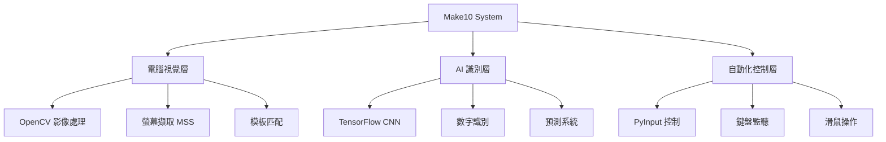

# 🎮 Make10 Solver

<div align="center">

[](https://python.org)
[](LICENSE)
[](https://github.com/astral-sh/ruff)
[](https://pytest.org)

**基於電腦視覺與機器學習的 Make10 數字拼圖自動化求解器**

[功能特色](#-功能特色) • [快速開始](#-快速開始) • [技術架構](#-技術架構) • [開發指南](#-開發指南) • [文件](#-文件)

</div>

## 🌟 功能特色

- 🎯 **智慧遊戲檢測** - 基於 OpenCV 的遊戲畫面自動識別
- 🧠 **AI 數字識別** - TensorFlow CNN 模型進行數字辨識
- 🎮 **自動化操作** - 精確的滑鼠控制與螢幕切換
- � **即時分析** - 遊戲狀態分析與策略計算
- 🔧 **模組化設計** - 可擴展的元件化架構
- 🧪 **完整測試** - 高覆蓋率的自動化測試

## 🚀 快速開始

### 環境需求

- **作業系統**: Windows 10/11
- **Python**: 3.12+
- **套件管理**: [UV](https://docs.astral.sh/uv/) (推薦) 或 pip

### 一鍵安裝

```bash
# 複製專案
git clone https://github.com/lingzinc/make10-solver.git
cd make10-solver

# 使用 UV (推薦)
powershell -c "irm https://astral.sh/uv/install.ps1 | iex"
uv sync --dev

# 或使用 pip
pip install -r requirements.txt
```

### 執行系統

```bash
# 啟動自動化系統
uv run run_system.py

# AI 模型訓練 (開發中)
uv run run_training.py

# 執行測試
uv run pytest -v --cov=.
```

## ⚡ 技術架構

<div align="center">



</div>

### 核心技術棧

| 領域 | 技術 | 版本 | 用途 |
|------|------|------|------|
| **電腦視覺** | OpenCV | 4.12.0 | 影像處理與檢測 |
| **機器學習** | TensorFlow | 2.19.0 | 數字識別模型 |
| **自動化** | PyInput | 1.8.1 | 鍵盤滑鼠控制 |
| **螢幕擷取** | MSS | 10.0.0 | 高效能螢幕擷取 |
| **數據處理** | NumPy/Pandas | 2.1.3/2.3.1 | 數值計算與分析 |

## 🏗️ 專案架構

```
make10-solver/
├── 📁 src/                    # 源碼目錄
│   ├── 🎮 automation/         # 自動化控制模組
│   ├── 🧠 ai/                 # AI 與機器學習
│   ├── 🎯 core/               # 核心系統邏輯
│   └── 🏷️ labeling/           # 標籤與訓練資料
├── 📁 config/                 # 配置與設定
├── 📁 data/                   # 資料與模型
├── 📁 tests/                  # 測試套件
├── 📁 docs/                   # 技術文件
└── 📄 pyproject.toml          # 專案設定
```

## 🔧 開發指南

### 開發環境設定

```bash
# 複製開發版本
git clone https://github.com/lingzinc/make10-solver.git
cd make10-solver

# 安裝開發相依性
uv sync --dev

# 啟動開發模式
uv run pre-commit install
```

### 程式碼品質

```bash
# 程式碼格式化
uv run ruff format .

# 程式碼檢查
uv run ruff check .

# 型別檢查
uv run mypy src/

# 執行測試
uv run pytest --cov=src --cov-report=html
```

## 📚 文件

- 📖 [開發者指南](docs/development-guide.md) - 深入開發說明
- 🏗️ [技術架構](docs/technical-architecture.md) - 系統架構設計
- 🧠 [AI 模型指南](docs/ai-model-guide.md) - 機器學習實作
- � [測試指南](docs/testing-guide.md) - 測試策略與執行
- 🔧 [故障排除](docs/troubleshooting.md) - 常見問題解決

## � 未來規劃

- [ ] 🧠 完整 AI 模型訓練流程
- [ ] 🎮 多遊戲模式支援
- [ ] 📊 遊戲策略最佳化演算法
- [ ] 🖥️ 圖形使用者介面
- [ ] 🌐 Web 介面與遠端控制

## 🤝 貢獻

歡迎提交 Issues 和 Pull Requests！請參閱 [開發指南](docs/development-guide.md) 了解貢獻流程。

## 📄 授權條款

本專案採用 [MIT License](LICENSE) 授權。
