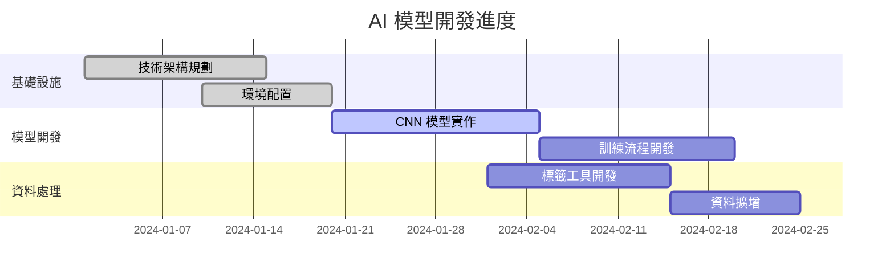

# AI 模型指南

> 🧠 Make10 專案的 AI 模型架構、訓練流程與部署策略 (開發中)

## 🚧 開發狀態

### 目前進度
- ✅ **技術架構規劃** - 完成模型設計與技術選型
- ✅ **環境配置** - TensorFlow 2.19.0 已安裝配置
- ✅ **資料結構** - 訓練資料目錄與模型存儲路徑已設定
- 🚧 **模型實作** - 待開發 (`src/ai/` 模組)
- 🚧 **訓練流程** - 待開發 (`run_training.py`)
- 🚧 **標籤工具** - 待開發 (`src/labeling/`)

### 規劃進度


## 🎯 AI 模型規劃

### 模型目標
- **主要任務**: 數字識別 (0-9 十類別分類)
- **輸入格式**: 224×224 RGB 影像 (ResNet50 標準輸入)
- **輸出格式**: 10 類別機率分佈
- **目標準確率**: >98% (驗證集，ResNet50 深度網路)
- **推理速度**: <10ms (單次預測)
- **模型大小**: <100MB (ResNet50 預訓練模型)

### 技術棧選擇
```python
# 核心框架
tensorflow = "2.19.0"        # 深度學習框架
numpy = "2.1.3"             # 數值計算
opencv-python = "4.12.0.88" # 影像預處理

# 資料處理
pandas = "2.3.1"            # 資料分析
pillow = "11.3.0"           # 影像格式支援
```

## 🏗️ 模型架構設計

### ResNet50 網路結構 (更新)
```python
def create_resnet50_digit_model(pretrained=True):
    """建立基於 ResNet50 的數字識別模型"""
    
    # 載入預訓練 ResNet50 (不含頂層)
    base_model = tf.keras.applications.ResNet50(
        weights='imagenet' if pretrained else None,
        include_top=False,
        input_shape=(224, 224, 3)
    )
    
    # 凍結預訓練層 (可選)
    if pretrained:
        base_model.trainable = False
    
    # 添加自定義分類層
    model = tf.keras.Sequential([
        # 輸入層
        tf.keras.layers.Input(shape=(224, 224, 3)),
        
        # ResNet50 特徵提取
        base_model,
        
        # 全域平均池化
        tf.keras.layers.GlobalAveragePooling2D(),
        
        # 全連接層
        tf.keras.layers.Dense(512, activation='relu'),
        tf.keras.layers.Dropout(0.5),
        tf.keras.layers.BatchNormalization(),
        
        # 輸出層 (10 類別數字分類)
        tf.keras.layers.Dense(10, activation='softmax')
    ])
    
    return model

def create_resnet50_from_scratch():
    """從頭訓練 ResNet50 (適用於大量資料)"""
    model = tf.keras.applications.ResNet50(
        weights=None,  # 不使用預訓練權重
        include_top=False,
        input_shape=(224, 224, 3)
    )
    
    # 添加分類頭
    x = tf.keras.layers.GlobalAveragePooling2D()(model.output)
    x = tf.keras.layers.Dense(512, activation='relu')(x)
    x = tf.keras.layers.Dropout(0.5)(x)
    x = tf.keras.layers.BatchNormalization()(x)
    outputs = tf.keras.layers.Dense(10, activation='softmax')(x)
    
    final_model = tf.keras.Model(inputs=model.input, outputs=outputs)
    return final_model
```

### 遷移學習策略
```python
def fine_tune_resnet50(model, train_data, val_data):
    """ResNet50 遷移學習微調"""
    
    # 階段 1: 凍結預訓練層，只訓練分類頭
    model.layers[1].trainable = False  # base_model 凍結
    
    model.compile(
        optimizer=tf.keras.optimizers.Adam(learning_rate=0.001),
        loss='categorical_crossentropy',
        metrics=['accuracy']
    )
    
    # 訓練分類頭
    history_1 = model.fit(
        train_data,
        validation_data=val_data,
        epochs=10,
        verbose=1
    )
    
    # 階段 2: 解凍部分層進行微調
    model.layers[1].trainable = True  # 解凍 base_model
    
    # 凍結前面的層，只微調後面的層
    for layer in model.layers[1].layers[:-20]:
        layer.trainable = False
    
    # 使用較小的學習率微調
    model.compile(
        optimizer=tf.keras.optimizers.Adam(learning_rate=0.0001),
        loss='categorical_crossentropy',
        metrics=['accuracy']
    )
    
    # 繼續訓練
    history_2 = model.fit(
        train_data,
        validation_data=val_data,
        epochs=20,
        verbose=1
    )
    
    return model, history_1, history_2
```

### 模型配置參數
```python
# config/settings.py - AI 模型配置 (ResNet50)
cfg.MODEL = EasyDict({
    'input_shape': (224, 224, 3),        # ResNet50 標準輸入尺寸
    'num_classes': 10,                   # 分類數量 (0-9)
    'batch_size': 16,                    # 批次大小 (ResNet50 記憶體需求較大)
    'confidence_threshold': 0.9,         # 信心度閾值 (提高精度)
    'voting_threshold': 0.7,             # 投票閾值
    'use_pretrained': True,              # 使用預訓練權重
    'fine_tune_layers': 20,              # 微調的層數
})

cfg.TRAINING = EasyDict({
    'epochs_stage1': 10,                 # 第一階段訓練輪數 (凍結預訓練層)
    'epochs_stage2': 20,                 # 第二階段訓練輪數 (微調)
    'learning_rate_stage1': 0.001,       # 第一階段學習率
    'learning_rate_stage2': 0.0001,      # 第二階段學習率 (較小)
    'validation_split': 0.2,             # 驗證集比例
    'early_stopping_patience': 15,       # 早停忍耐度 (增加)
})

cfg.DATA_AUGMENTATION = EasyDict({
    'rotation_range': 10,                # 旋轉角度範圍
    'width_shift_range': 0.1,            # 水平移動範圍
    'height_shift_range': 0.1,           # 垂直移動範圍
    'zoom_range': 0.1,                   # 縮放範圍
    'horizontal_flip': False,            # 不水平翻轉 (數字)
    'fill_mode': 'constant',             # 填充模式
    'cval': 0.0,                         # 填充值
})
```

## 📊 資料流程設計

### 資料結構 (目前已建立)
```
data/
├── training/                # 訓練資料集
│   ├── images/             # 訓練影像檔案
│   └── labels/             # 對應標籤資料
├── models/                 # 模型存儲
│   ├── checkpoints/        # 訓練檢查點
│   └── exports/            # 最終匯出模型
│       └── model.keras     # 主要模型檔案
└── assets/                 # 輔助資源
    └── templates/          # 模板影像
```

### 資料預處理流程 (ResNet50 適配)
```python
def preprocess_image_for_resnet50(image):
    """影像預處理管道 - ResNet50 版本"""
    
    # 1. 尺寸調整到 ResNet50 標準輸入
    resized = cv2.resize(image, (224, 224))
    
    # 2. 灰階轉 RGB (如果需要)
    if len(resized.shape) == 2:
        # 灰階影像轉為 3 通道
        rgb_image = cv2.cvtColor(resized, cv2.COLOR_GRAY2RGB)
    elif resized.shape[2] == 1:
        rgb_image = np.repeat(resized, 3, axis=2)
    else:
        rgb_image = cv2.cvtColor(resized, cv2.COLOR_BGR2RGB)
    
    # 3. 正規化 (ImageNet 預訓練標準)
    normalized = rgb_image.astype(np.float32)
    normalized = tf.keras.applications.resnet50.preprocess_input(normalized)
    
    # 4. 新增批次維度
    batched = np.expand_dims(normalized, axis=0)
    
    return batched

def augment_training_data_resnet50(images, labels):
    """ResNet50 專用資料擴增策略"""
    
    datagen = tf.keras.preprocessing.image.ImageDataGenerator(
        rotation_range=10,           # 輕微旋轉
        width_shift_range=0.1,       # 水平移動
        height_shift_range=0.1,      # 垂直移動
        zoom_range=0.1,              # 縮放
        brightness_range=[0.8, 1.2], # 亮度調整
        fill_mode='constant',        # 邊界填充
        cval=0.0,                    # 填充值
        preprocessing_function=tf.keras.applications.resnet50.preprocess_input
    )
    
    # 生成擴增資料
    augmented_generator = datagen.flow(
        images, labels,
        batch_size=32,
        shuffle=True
    )
    
    return augmented_generator

def create_data_pipeline_resnet50(image_dir, label_file, batch_size=16):
    """建立 ResNet50 資料管道"""
    
    # 讀取資料
    images, labels = load_training_data(image_dir, label_file)
    
    # 轉換為 TensorFlow 資料集
    dataset = tf.data.Dataset.from_tensor_slices((images, labels))
    
    # 預處理函式
    def preprocess_fn(image, label):
        # 調整大小並轉換為 RGB
        image = tf.image.resize(image, [224, 224])
        image = tf.cast(image, tf.float32)
        
        # 如果是灰階，複製到 3 個通道
        if tf.shape(image)[-1] == 1:
            image = tf.repeat(image, 3, axis=-1)
        
        # ImageNet 標準化
        image = tf.keras.applications.resnet50.preprocess_input(image)
        
        return image, label
    
    # 應用預處理
    dataset = dataset.map(preprocess_fn, num_parallel_calls=tf.data.AUTOTUNE)
    
    # 批次化和快取
    dataset = dataset.batch(batch_size)
    dataset = dataset.prefetch(tf.data.AUTOTUNE)
    
    return dataset
```

### 推理流程 (ResNet50 版本)
```python
class ResNet50DigitPredictor:
    """基於 ResNet50 的數字識別預測器"""
    
    def __init__(self, model_path):
        self.model = tf.keras.models.load_model(model_path)
        self.input_size = (224, 224)
        
    def preprocess_single_image(self, image_region):
        """單一影像預處理"""
        # 調整大小
        resized = cv2.resize(image_region, self.input_size)
        
        # 確保 RGB 格式
        if len(resized.shape) == 2:
            rgb_image = cv2.cvtColor(resized, cv2.COLOR_GRAY2RGB)
        elif resized.shape[2] == 1:
            rgb_image = np.repeat(resized, 3, axis=2)
        else:
            rgb_image = cv2.cvtColor(resized, cv2.COLOR_BGR2RGB)
        
        # ImageNet 標準預處理
        processed = tf.keras.applications.resnet50.preprocess_input(
            rgb_image.astype(np.float32)
        )
        
        # 新增批次維度
        return np.expand_dims(processed, axis=0)
        
    def predict_digit(self, image_region):
        """預測單一數字"""
        # 預處理
        processed = self.preprocess_single_image(image_region)
        
        # 模型推理
        prediction = self.model.predict(processed, verbose=0)
        
        # 結果解析
        digit = np.argmax(prediction[0])
        confidence = np.max(prediction[0])
        
        # 所有類別的機率
        probabilities = prediction[0]
        
        return {
            'digit': int(digit),
            'confidence': float(confidence),
            'probabilities': probabilities.tolist()
        }
    
    def predict_batch(self, image_regions):
        """批次預測多個數字"""
        # 批次預處理
        batch_data = []
        for img in image_regions:
            processed = self.preprocess_single_image(img)
            batch_data.append(processed[0])  # 移除批次維度
        
        batch = np.stack(batch_data)
        
        # 批次推理
        predictions = self.model.predict(batch, verbose=0)
        
        # 解析結果
        results = []
        for pred in predictions:
            digit = np.argmax(pred)
            confidence = np.max(pred)
            results.append({
                'digit': int(digit),
                'confidence': float(confidence),
                'probabilities': pred.tolist()
            })
            
        return results
    
    def predict_with_tta(self, image_region, num_augmentations=5):
        """使用測試時增強 (TTA) 提高預測準確性"""
        predictions = []
        
        # 原始預測
        original_pred = self.predict_digit(image_region)
        predictions.append(original_pred['probabilities'])
        
        # 增強版本預測
        for _ in range(num_augmentations):
            # 輕微旋轉和縮放
            h, w = image_region.shape[:2]
            angle = np.random.uniform(-5, 5)
            scale = np.random.uniform(0.95, 1.05)
            
            center = (w//2, h//2)
            M = cv2.getRotationMatrix2D(center, angle, scale)
            augmented = cv2.warpAffine(image_region, M, (w, h))
            
            pred = self.predict_digit(augmented)
            predictions.append(pred['probabilities'])
        
        # 平均預測結果
        avg_probs = np.mean(predictions, axis=0)
        final_digit = np.argmax(avg_probs)
        final_confidence = np.max(avg_probs)
        
        return {
            'digit': int(final_digit),
            'confidence': float(final_confidence),
            'probabilities': avg_probs.tolist(),
            'tta_predictions': len(predictions)
        }
```

## 🏃‍♂️ 訓練流程設計

### 訓練管道 (規劃)
```python
# run_training.py - 主要訓練入口
def main_training_pipeline():
    """主要訓練流程"""
    
    # 1. 資料載入與預處理
    train_data, val_data = load_training_data()
    
    # 2. 模型建立與編譯
    model = create_digit_recognition_model()
    model.compile(
        optimizer='adam',
        loss='categorical_crossentropy',
        metrics=['accuracy']
    )
    
    # 3. 訓練配置
    callbacks = [
        tf.keras.callbacks.ModelCheckpoint(
            'data/models/checkpoints/best_model.h5',
            save_best_only=True
        ),
        tf.keras.callbacks.EarlyStopping(
            patience=10,
            restore_best_weights=True
        ),
        tf.keras.callbacks.ReduceLROnPlateau(
            factor=0.5,
            patience=5
        )
    ]
    
    # 4. 執行訓練
    history = model.fit(
        train_data,
        validation_data=val_data,
        epochs=50,
        callbacks=callbacks
    )
    
    # 5. 模型評估與儲存
    evaluate_and_save_model(model, val_data)
    
    return model, history
```

### 模型評估策略 (規劃)
```python
def evaluate_model_performance(model, test_data):
    """模型效能評估"""
    
    # 基本準確率
    test_loss, test_accuracy = model.evaluate(test_data)
    
    # 混淆矩陣
    predictions = model.predict(test_data)
    y_pred = np.argmax(predictions, axis=1)
    y_true = # ... 從 test_data 取得真實標籤
    
    confusion_matrix = tf.math.confusion_matrix(y_true, y_pred)
    
    # 各類別準確率
    class_accuracy = np.diag(confusion_matrix) / np.sum(confusion_matrix, axis=1)
    
    # 推理速度測試
    inference_times = benchmark_inference_speed(model)
    
    return {
        'accuracy': test_accuracy,
        'class_accuracy': class_accuracy,
        'inference_time': np.mean(inference_times)
    }
```

## 🚀 部署策略

### 模型最佳化 (規劃)
```python
def optimize_model_for_deployment(model):
    """模型部署最佳化"""
    
    # 量化處理
    converter = tf.lite.TFLiteConverter.from_keras_model(model)
    converter.optimizations = [tf.lite.Optimize.DEFAULT]
    
    # 轉換為 TensorFlow Lite
    tflite_model = converter.convert()
    
    # 儲存最佳化模型
    with open('data/models/exports/model_optimized.tflite', 'wb') as f:
        f.write(tflite_model)
    
    return tflite_model

def benchmark_deployment_performance():
    """部署效能測試"""
    # 記憶體使用量
    # 推理速度
    # 準確率損失
    pass
```

### 整合策略
```python
# 在 src/automation/screen_utils.py 中整合
from src.ai.predictor import DigitPredictor

class GameAutomationSystem:
    def __init__(self):
        # 載入 AI 模型
        self.predictor = DigitPredictor(cfg.PATHS.MODEL.main_model)
    
    def recognize_game_numbers(self, screenshot):
        """識別遊戲中的數字"""
        # 1. 提取數字區域
        number_regions = extract_number_regions(screenshot)
        
        # 2. AI 識別
        digits = self.predictor.predict_batch(number_regions)
        
        # 3. 信心度過濾
        reliable_digits = [
            (digit, pos) for (digit, conf), pos 
            in zip(digits, number_regions)
            if conf > cfg.MODEL.confidence_threshold
        ]
        
        return reliable_digits
```

## 📈 效能指標與監控

### 關鍵指標 (規劃)
- **準確率**: >95% (整體準確率)
- **各類別準確率**: >90% (每個數字類別)
- **推理速度**: <5ms (單次預測)
- **記憶體使用**: <100MB (模型載入後)
- **模型大小**: <10MB (儲存檔案)

### 監控機制 (規劃)
```python
def log_prediction_metrics(predictions, ground_truth):
    """記錄預測效能指標"""
    accuracy = calculate_accuracy(predictions, ground_truth)
    confidence_dist = analyze_confidence_distribution(predictions)
    
    logger.info(f"預測準確率: {accuracy:.3f}")
    logger.info(f"平均信心度: {confidence_dist['mean']:.3f}")
    
def monitor_inference_performance():
    """監控推理效能"""
    start_time = time.time()
    # ... 執行推理
    inference_time = time.time() - start_time
    
    if inference_time > 0.01:  # 10ms 閾值
        logger.warning(f"推理時間過長: {inference_time:.3f}s")
```

## 🔗 後續開發計畫

### 短期目標 (1-2 個月)
- [ ] 實作 `src/ai/model_manager.py` - 模型管理器
- [ ] 實作 `src/ai/predictor.py` - 預測器模組
- [ ] 完成 `run_training.py` - 訓練流程
- [ ] 建立基礎資料集與標籤

### 中期目標 (3-6 個月)
- [ ] 開發 `src/labeling/` - 資料標註工具
- [ ] 模型效能最佳化與量化
- [ ] 建立模型版本管理系統
- [ ] 自動化訓練與評估流程

### 長期目標 (6+ 個月)
- [ ] 多模型集成與投票機制
- [ ] 線上學習與模型更新
- [ ] A/B 測試框架
- [ ] 雲端訓練與部署

### 模型參數說明
| 層級 | 類型 | 輸出形狀 | 參數數量 | 說明 |
|------|------|----------|----------|------|
| Input | InputLayer | (None, 28, 28, 1) | 0 | 輸入層 |
| Conv2D_1 | Conv2D | (None, 28, 28, 16) | 160 | 3x3 卷積，16 濾波器 |
| MaxPool_1 | MaxPooling2D | (None, 14, 14, 16) | 0 | 2x2 最大池化 |
| Dropout_1 | Dropout | (None, 14, 14, 16) | 0 | 20% 丟棄率 |
| Conv2D_2 | Conv2D | (None, 14, 14, 32) | 4,640 | 3x3 卷積，32 濾波器 |
| MaxPool_2 | MaxPooling2D | (None, 7, 7, 32) | 0 | 2x2 最大池化 |
| Dropout_2 | Dropout | (None, 7, 7, 32) | 0 | 30% 丟棄率 |
| Flatten | Flatten | (None, 1568) | 0 | 拉平 |
| Dense_1 | Dense | (None, 64) | 100,416 | 全連接層 |
| Dropout_3 | Dropout | (None, 64) | 0 | 50% 丟棄率 |
| Dense_2 | Dense | (None, 10) | 650 | 輸出層 |

**總參數**: 105,866 個

### 模型編譯設定
```python
model.compile(
    optimizer='adam',               # Adam 優化器
    loss='categorical_crossentropy', # 分類交叉熵損失
    metrics=['accuracy']            # 準確率評估
)
```

## 📊 資料處理流程

### 圖像預處理管道
```python
def preprocess_cell_image(cell_image):
    """預處理 cell 圖像"""
    # 1. 尺寸調整
    resized = cv2.resize(cell_image, (28, 28))
    
    # 2. 灰階轉換
    if len(resized.shape) == 3:
        gray = cv2.cvtColor(resized, cv2.COLOR_BGR2GRAY)
    else:
        gray = resized
    
    # 3. 正規化 (0-1)
    normalized = gray.astype(np.float32) / 255.0
    
    # 4. 增加批次維度
    batch_ready = normalized.reshape(1, 28, 28, 1)
    
    return batch_ready
```

### 資料增強技術
```python
def augment_training_data(images, labels):
    """資料增強以提升模型泛化能力"""
    augmented_images = []
    augmented_labels = []
    
    for img, label in zip(images, labels):
        # 原始圖像
        augmented_images.append(img)
        augmented_labels.append(label)
        
        # 旋轉 (-15 到 15 度)
        angle = random.uniform(-15, 15)
        rotated = rotate_image(img, angle)
        augmented_images.append(rotated)
        augmented_labels.append(label)
        
        # 縮放 (0.9 到 1.1 倍)
        scale = random.uniform(0.9, 1.1)
        scaled = scale_image(img, scale)
        augmented_images.append(scaled)
        augmented_labels.append(label)
        
        # 平移 (-2 到 2 像素)
        dx, dy = random.randint(-2, 2), random.randint(-2, 2)
        translated = translate_image(img, dx, dy)
        augmented_images.append(translated)
        augmented_labels.append(label)
    
    return np.array(augmented_images), np.array(augmented_labels)
```

## 🎓 訓練工作流程

### 完整訓練管道
```python
def train_model(force_new=False, use_mnist=False):
    """完整的模型訓練管道"""
    
    # 1. 資料載入
    if use_mnist:
        X_train, y_train, X_test, y_test = load_mnist_data()
    else:
        X_train, y_train, X_test, y_test = load_custom_data()
    
    # 2. 資料預處理
    X_train = preprocess_training_data(X_train)
    X_test = preprocess_training_data(X_test)
    
    # 3. 標籤編碼
    y_train = to_categorical(y_train, 10)
    y_test = to_categorical(y_test, 10)
    
    # 4. 資料增強
    X_train_aug, y_train_aug = augment_training_data(X_train, y_train)
    
    # 5. 模型建立或載入
    if force_new or not model_exists():
        model = create_model()
    else:
        model = load_existing_model()
    
    # 6. 訓練設定
    callbacks = [
        EarlyStopping(
            monitor='val_accuracy',
            patience=5,
            restore_best_weights=True
        ),
        ReduceLROnPlateau(
            monitor='val_loss',
            factor=0.5,
            patience=3,
            min_lr=1e-6
        ),
        ModelCheckpoint(
            filepath='checkpoints/model_epoch_{epoch:02d}.keras',
            save_best_only=True,
            monitor='val_accuracy'
        )
    ]
    
    # 7. 模型訓練
    history = model.fit(
        X_train_aug, y_train_aug,
        validation_data=(X_test, y_test),
        epochs=20,
        batch_size=16,
        callbacks=callbacks,
        verbose=1
    )
    
    # 8. 模型評估
    test_loss, test_accuracy = model.evaluate(X_test, y_test, verbose=0)
    
    # 9. 模型儲存
    save_model(model, f"model_acc_{test_accuracy:.3f}.keras")
    
    return model, history, test_accuracy
```

### 訓練參數調整
```python
# 基礎訓練參數
TRAINING_CONFIG = {
    'epochs': 20,
    'batch_size': 16,
    'validation_split': 0.3,
    'learning_rate': 0.001,
    'early_stopping_patience': 5,
    'lr_reduction_patience': 3,
    'dropout_rates': [0.2, 0.3, 0.5]
}

# 進階訓練參數
ADVANCED_CONFIG = {
    'use_data_augmentation': True,
    'augmentation_factor': 3,
    'use_transfer_learning': False,
    'fine_tune_layers': None,
    'regularization_l2': 0.001
}
```

## 🔄 增量學習系統

### 持續改進機制
```python
class IncrementalLearner:
    """增量學習管理器"""
    
    def __init__(self, model_manager):
        self.model_manager = model_manager
        self.new_data_buffer = []
        self.min_samples_for_retrain = 50
    
    def add_correction(self, image, true_label, predicted_label):
        """添加人工修正的樣本"""
        if predicted_label != true_label:
            self.new_data_buffer.append({
                'image': image,
                'label': true_label,
                'timestamp': datetime.now(),
                'correction_type': 'manual'
            })
    
    def add_low_confidence_sample(self, image, predicted_label, confidence):
        """添加低信心度樣本"""
        if confidence < 0.8:
            self.new_data_buffer.append({
                'image': image,
                'predicted_label': predicted_label,
                'confidence': confidence,
                'timestamp': datetime.now(),
                'correction_type': 'low_confidence'
            })
    
    def should_retrain(self):
        """判斷是否需要重新訓練"""
        return len(self.new_data_buffer) >= self.min_samples_for_retrain
    
    def retrain_model(self):
        """使用新資料重新訓練模型"""
        if not self.should_retrain():
            return False
        
        # 準備新資料
        new_images = [sample['image'] for sample in self.new_data_buffer]
        new_labels = [sample['label'] for sample in self.new_data_buffer]
        
        # 載入現有模型
        model = self.model_manager.load_model()
        
        # 增量訓練
        history = self._incremental_training(model, new_images, new_labels)
        
        # 儲存更新後的模型
        self.model_manager.save_model(model, backup=True)
        
        # 清空緩衝區
        self.new_data_buffer.clear()
        
        return True
```

## 📈 模型效能監控

### 預測品質評估
```python
class ModelPerformanceMonitor:
    """模型效能監控器"""
    
    def __init__(self):
        self.prediction_history = []
        self.accuracy_window = 100  # 滑動視窗大小
    
    def record_prediction(self, image, prediction, confidence, is_correct=None):
        """記錄預測結果"""
        record = {
            'timestamp': datetime.now(),
            'prediction': prediction,
            'confidence': confidence,
            'is_correct': is_correct
        }
        self.prediction_history.append(record)
    
    def get_recent_accuracy(self):
        """取得近期準確率"""
        recent = self.prediction_history[-self.accuracy_window:]
        correct_predictions = [r for r in recent if r['is_correct'] is True]
        if len(recent) == 0:
            return None
        return len(correct_predictions) / len(recent)
    
    def get_confidence_distribution(self):
        """取得信心度分佈"""
        recent = self.prediction_history[-self.accuracy_window:]
        confidences = [r['confidence'] for r in recent]
        return {
            'mean': np.mean(confidences),
            'std': np.std(confidences),
            'min': np.min(confidences),
            'max': np.max(confidences),
            'below_threshold': len([c for c in confidences if c < 0.8])
        }
    
    def should_alert(self):
        """判斷是否需要警報"""
        accuracy = self.get_recent_accuracy()
        if accuracy is not None and accuracy < 0.8:
            return True
        
        conf_dist = self.get_confidence_distribution()
        if conf_dist['below_threshold'] > 20:  # 超過 20 個低信心度預測
            return True
        
        return False
```

### A/B 測試框架
```python
class ModelABTester:
    """模型 A/B 測試框架"""
    
    def __init__(self, model_a, model_b, split_ratio=0.5):
        self.model_a = model_a
        self.model_b = model_b
        self.split_ratio = split_ratio
        self.results_a = []
        self.results_b = []
    
    def predict(self, image):
        """隨機選擇模型進行預測"""
        if random.random() < self.split_ratio:
            prediction = self.model_a.predict(image)
            self.results_a.append(prediction)
            return prediction, 'model_a'
        else:
            prediction = self.model_b.predict(image)
            self.results_b.append(prediction)
            return prediction, 'model_b'
    
    def get_performance_comparison(self):
        """比較兩個模型的效能"""
        return {
            'model_a': {
                'count': len(self.results_a),
                'avg_confidence': np.mean([r['confidence'] for r in self.results_a]),
                'accuracy': self._calculate_accuracy(self.results_a)
            },
            'model_b': {
                'count': len(self.results_b),
                'avg_confidence': np.mean([r['confidence'] for r in self.results_b]),
                'accuracy': self._calculate_accuracy(self.results_b)
            }
        }
```

## 🔧 模型管理系統

### 模型版本控制
```python
class ModelVersionManager:
    """模型版本管理器"""
    
    def __init__(self, base_path="data/models/"):
        self.base_path = Path(base_path)
        self.current_model = None
        self.model_registry = {}
    
    def save_model(self, model, version=None, metadata=None):
        """儲存模型並記錄版本"""
        if version is None:
            version = self._generate_version()
        
        model_path = self.base_path / f"model_v{version}.keras"
        model.save(model_path)
        
        # 記錄 metadata
        metadata_path = self.base_path / f"model_v{version}_metadata.json"
        with open(metadata_path, 'w') as f:
            json.dump({
                'version': version,
                'timestamp': datetime.now().isoformat(),
                'accuracy': metadata.get('accuracy', None),
                'loss': metadata.get('loss', None),
                'architecture': self._get_architecture_info(model),
                'training_config': metadata.get('training_config', {})
            }, f, indent=2)
        
        # 更新註冊表
        self.model_registry[version] = {
            'path': model_path,
            'metadata_path': metadata_path,
            'created_at': datetime.now()
        }
        
        return version
    
    def load_model(self, version='latest'):
        """載入指定版本的模型"""
        if version == 'latest':
            version = self._get_latest_version()
        
        if version not in self.model_registry:
            raise ValueError(f"Model version {version} not found")
        
        model_path = self.model_registry[version]['path']
        model = tf.keras.models.load_model(model_path)
        self.current_model = model
        
        return model
    
    def list_models(self):
        """列出所有可用的模型版本"""
        return list(self.model_registry.keys())
    
    def rollback_to_version(self, version):
        """回滾到指定版本"""
        model = self.load_model(version)
        
        # 將指定版本設為當前版本
        current_path = self.base_path / "model.keras"
        shutil.copy2(self.model_registry[version]['path'], current_path)
        
        return model
```

### 模型部署管道
```python
class ModelDeploymentPipeline:
    """模型部署管道"""
    
    def __init__(self, version_manager, performance_monitor):
        self.version_manager = version_manager
        self.performance_monitor = performance_monitor
        self.deployment_criteria = {
            'min_accuracy': 0.85,
            'min_confidence': 0.8,
            'max_inference_time': 50  # ms
        }
    
    def validate_model(self, model, test_data):
        """驗證模型是否符合部署標準"""
        results = {
            'accuracy': None,
            'avg_confidence': None,
            'inference_time': None,
            'passes_validation': False
        }
        
        # 準確率測試
        test_loss, test_accuracy = model.evaluate(test_data[0], test_data[1], verbose=0)
        results['accuracy'] = test_accuracy
        
        # 信心度測試
        predictions = model.predict(test_data[0])
        confidences = np.max(predictions, axis=1)
        results['avg_confidence'] = np.mean(confidences)
        
        # 推理時間測試
        start_time = time.time()
        _ = model.predict(test_data[0][:10])
        end_time = time.time()
        results['inference_time'] = (end_time - start_time) / 10 * 1000  # ms per sample
        
        # 檢查是否通過所有標準
        passes = (
            results['accuracy'] >= self.deployment_criteria['min_accuracy'] and
            results['avg_confidence'] >= self.deployment_criteria['min_confidence'] and
            results['inference_time'] <= self.deployment_criteria['max_inference_time']
        )
        results['passes_validation'] = passes
        
        return results
    
    def deploy_model(self, model, version, test_data):
        """部署模型到生產環境"""
        # 驗證模型
        validation_results = self.validate_model(model, test_data)
        
        if not validation_results['passes_validation']:
            raise ValueError(f"Model validation failed: {validation_results}")
        
        # 備份當前模型
        current_model_path = Path("data/models/model.keras")
        if current_model_path.exists():
            backup_path = Path(f"data/models/model_backup_{datetime.now().strftime('%Y%m%d_%H%M%S')}.keras")
            shutil.copy2(current_model_path, backup_path)
        
        # 部署新模型
        model.save(current_model_path)
        
        # 記錄部署
        deployment_log = {
            'version': version,
            'timestamp': datetime.now().isoformat(),
            'validation_results': validation_results,
            'deployed_by': 'automated_pipeline'
        }
        
        with open("data/models/deployment_log.json", 'a') as f:
            f.write(json.dumps(deployment_log) + "\n")
        
        return deployment_log
```

## 🎯 模型最佳化策略

### 量化與壓縮
```python
def optimize_model_for_inference(model):
    """為推理優化模型"""
    
    # TensorFlow Lite 轉換
    converter = tf.lite.TFLiteConverter.from_keras_model(model)
    
    # 量化設定
    converter.optimizations = [tf.lite.Optimize.DEFAULT]
    converter.target_spec.supported_types = [tf.float16]
    
    # 轉換模型
    tflite_model = converter.convert()
    
    # 儲存優化後的模型
    with open('data/models/model_optimized.tflite', 'wb') as f:
        f.write(tflite_model)
    
    return tflite_model

def benchmark_model_performance(model, test_data, num_runs=100):
    """基準測試模型效能"""
    import time
    
    # 預熱
    _ = model.predict(test_data[:1])
    
    # 測試推理時間
    times = []
    for _ in range(num_runs):
        start = time.time()
        _ = model.predict(test_data[:1])
        end = time.time()
        times.append((end - start) * 1000)  # ms
    
    return {
        'avg_inference_time': np.mean(times),
        'std_inference_time': np.std(times),
        'min_inference_time': np.min(times),
        'max_inference_time': np.max(times),
        'p95_inference_time': np.percentile(times, 95)
    }
```

透過這個完整的 AI 模型指南，您可以有效地訓練、管理和部署 Make10 專案中的數字識別模型，並建立持續改進的機制。
