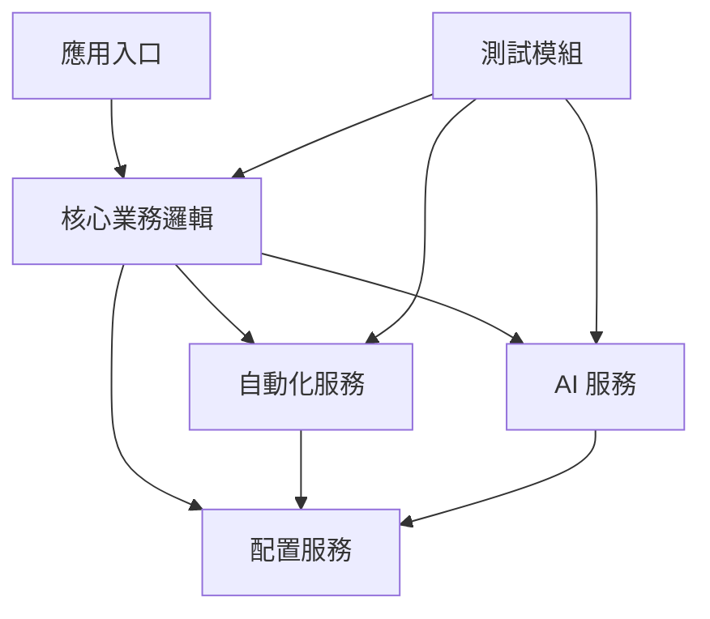

# 開發指南

> 🛠️ Make10 專案的開發流程、程式碼規範與最佳實務

## � 開發環境設定

### 快速開始
```bash
# 複製專案
git clone https://github.com/lingzinc/make10-solver.git
cd make10-solver

# 安裝開發環境
uv sync --dev

# 啟動開發工具
uv run pre-commit install    # Git hooks (如果有)
```

### 開發工具配置
```bash
# 程式碼格式化工具
uv run ruff format .         # 格式化程式碼
uv run ruff check .          # 程式碼檢查

# 型別檢查
uv run mypy src/             # 靜態型別檢查

# 測試工具
uv run pytest -v            # 執行測試
uv run pytest --cov=src     # 覆蓋率測試
```

## �🏗️ 專案架構設計

### 核心設計原則
- **模組化** - 功能獨立，介面清晰
- **可擴展** - 支援新功能的快速整合
- **可測試** - 每個模組都有對應測試
- **可維護** - 清晰的程式碼結構與文件
- **效能導向** - 考慮記憶體與 CPU 最佳化

### 系統分層架構
```
┌─────────────────────────────────────┐
│          應用層 (Application)       │  run_system.py, run_training.py
├─────────────────────────────────────┤
│          業務層 (Business)          │  src/core/main.py
├─────────────────────────────────────┤
│          服務層 (Service)           │  src/automation/, src/ai/
├─────────────────────────────────────┤
│          資料層 (Data)              │  config/, data/
└─────────────────────────────────────┘
```

### 模組依賴關係


## � 程式碼規範

### Python 編程風格
```python
# 檔案註解範例
"""
Make10 遊戲自動化系統 - 螢幕工具模組

提供螢幕擷取、滑鼠控制、模板匹配等功能。
"""

# 函式註解範例
def capture_screen() -> np.ndarray | None:
    """
    擷取當前螢幕畫面
    
    Returns:
        np.ndarray | None: 螢幕影像陣列，失敗時回傳 None
        
    Raises:
        ScreenCaptureError: 螢幕擷取失敗
    """
    pass

# 類別註解範例
class GameAutomationSystem:
    """Make10 遊戲自動化系統核心類別"""
    
    def __init__(self):
        """初始化自動化系統"""
        self.initialized = False
```

### 命名規範
```python
# 變數命名 (snake_case)
screen_capture_delay = 0.1
max_retry_attempts = 3

# 函式命名 (snake_case)
def capture_screen():
def find_reset_button():

# 類別命名 (PascalCase)
class GameAutomationSystem:
class ModelManager:

# 常數命名 (SCREAMING_SNAKE_CASE)
DEFAULT_TIMEOUT = 30
MAX_RETRY_COUNT = 5
```

### 錯誤處理規範
```python
# 推薦的錯誤處理方式
def safe_operation() -> bool:
    """安全執行操作，包含完整錯誤處理"""
    try:
        # 主要邏輯
        result = risky_operation()
        logger.info("操作成功完成")
        return True
        
    except SpecificError as e:
        logger.error(f"特定錯誤: {e}")
        return False
        
    except Exception as e:
        logger.error(f"未預期錯誤: {e}")
        return False
        
    finally:
        # 清理資源
        cleanup_resources()
```

## 🧪 測試策略

### 測試架構
```
tests/
├── test_config_settings.py     # 配置系統測試
├── test_keyboard_listener.py   # 鍵盤監聽測試
├── test_screen_utils.py        # 螢幕工具測試
└── fixtures/                   # 測試資料
```

### 測試撰寫範例
```python
# tests/test_screen_utils.py
import pytest
from unittest.mock import patch, MagicMock
from src.automation.screen_utils import capture_screen

class TestScreenUtils:
    """螢幕工具測試類別"""
    
    @patch('src.automation.screen_utils.mss')
    def test_capture_screen_success(self, mock_mss):
        """測試螢幕擷取成功情況"""
        # 設定 mock
        mock_screenshot = MagicMock()
        mock_mss.mss().grab.return_value = mock_screenshot
        
        # 執行測試
        result = capture_screen()
        
        # 驗證結果
        assert result is not None
        mock_mss.mss().grab.assert_called_once()
```

### 測試指令
```bash
# 執行所有測試
uv run pytest -v

# 特定模組測試
uv run pytest tests/test_screen_utils.py -v

# 覆蓋率測試
uv run pytest --cov=src --cov-report=html

# 效能測試
uv run pytest --benchmark-only
```

## 🔧 配置管理

### 配置系統結構
```python
# config/settings.py - 配置主檔案
from easydict import EasyDict
from .constants import *

cfg = EasyDict()

# 路徑配置
cfg.PATHS = EasyDict({
    'MODEL': {
        'main_model': 'data/models/exports/model.keras',
        'checkpoints_dir': 'data/models/checkpoints'
    },
    'TRAINING': {
        'images_dir': 'data/training/images',
        'labels_dir': 'data/training/labels'
    }
})

# 系統參數
cfg.AUTOMATION = EasyDict({
    'click_delay': CLICK_DELAY,
    'retry_attempts': RETRY_ATTEMPTS
})
```

### 配置使用方式
```python
# 在程式碼中使用配置
from config.settings import cfg

# 存取路徑
model_path = cfg.PATHS.MODEL.main_model

# 存取參數
delay = cfg.AUTOMATION.click_delay

# 檢查配置是否存在
if hasattr(cfg.PATHS, 'MODEL'):
    print("模型路徑已配置")
```

## 📝 日誌系統

### 日誌配置
```python
# 使用 loguru 進行日誌管理
from loguru import logger

# 日誌設定
logger.add(
    "logs/make10_system.log",
    rotation="1 day",           # 每天輪轉
    retention="7 days",         # 保留 7 天
    level="INFO",              # 最低級別
    format="{time:YY-MM-DD HH:mm:ss} [{level}] {message}"
)
```

### 日誌使用規範
```python
# 不同層級的日誌使用
logger.debug("除錯資訊: 變數值 = {}", variable_value)
logger.info("系統啟動完成")
logger.warning("配置檔案不存在，使用預設值")
logger.error("檔案載入失敗: {}", error_message)
logger.critical("系統無法啟動")

# 結構化日誌
logger.info("用戶操作", 
    user_id=123, 
    action="click_button", 
    position=(100, 200)
)
```

## 🚀 開發工作流程

### 新增功能開發流程
1. **建立功能分支**
```bash
git checkout -b feature/new-function-name
```

2. **撰寫程式碼**
   - 在適當的模組目錄建立檔案
   - 遵循程式碼規範與註解標準
   - 使用配置系統管理參數

3. **撰寫測試**
```python
# 建立對應測試檔案
tests/test_new_function.py
```

4. **執行測試與檢查**
```bash
uv run pytest tests/test_new_function.py -v
uv run ruff check .
uv run mypy src/
```

5. **更新文件**
   - 更新 README.md (如果影響使用方式)
   - 更新技術文件 (如果影響架構)
   - 新增或更新 docstring

6. **提交程式碼**
```bash
git add .
git commit -m "feat: 新增 XXX 功能"
git push origin feature/new-function-name
```

### Bug 修復流程
1. **建立修復分支**
```bash
git checkout -b fix/bug-description
```

2. **重現問題**
   - 撰寫失敗的測試案例
   - 確認問題存在

3. **修復問題**
   - 修改程式碼
   - 確保測試通過

4. **驗證修復**
```bash
uv run pytest -v
uv run pytest --cov=src
```

## 📊 效能最佳化指南

### 記憶體最佳化
```python
# 使用生成器減少記憶體使用
def process_large_dataset():
    for item in large_dataset:
        yield process_item(item)

# 及時釋放大物件
large_array = np.zeros((1000, 1000))
# ... 使用 large_array
del large_array  # 明確釋放記憶體
```

### CPU 最佳化
```python
# 使用 NumPy 向量化操作
# ❌ 避免
result = []
for i in range(len(array)):
    result.append(array[i] * 2)

# ✅ 推薦
result = array * 2

# 使用適當的資料結構
# ❌ 頻繁查找使用 list
if item in large_list:  # O(n)

# ✅ 頻繁查找使用 set
if item in large_set:   # O(1)
```

## 🔗 相關資源與工具

### 開發工具
- 🎨 **Ruff** - 程式碼格式化與檢查
- 🧪 **Pytest** - 測試框架
- 📊 **MyPy** - 靜態型別檢查
- 📝 **Loguru** - 日誌管理

### 外部文件
- 🐍 [Python 官方風格指南](https://pep8.org/)
- 🧪 [Pytest 文件](https://pytest.org/)
- 📷 [OpenCV Python 指南](https://docs.opencv.org/4.x/d6/d00/tutorial_py_root.html)
- 🧠 [TensorFlow 開發指南](https://tensorflow.org/guide)

### 社群資源
- 🐙 [專案 GitHub](https://github.com/lingzinc/make10-solver)
- 💬 [Issues 討論區](https://github.com/lingzinc/make10-solver/issues)
- 📚 [技術文件](../README.md)
    def save_model(self, model) -> bool # 儲存模型
    def get_model_info(self) -> dict    # 取得模型資訊

# predictor.py - 預測介面
class Predictor:
    def predict_single_cell(self, cell) -> int        # 單一預測
    def predict_batch_cells(self, cells) -> list      # 批次預測
    def predict_with_confidence(self, cell) -> tuple  # 含信心度預測

# image_processor.py - 圖像預處理
class ImageProcessor:
    def preprocess_cell(self, image) -> np.ndarray    # Cell 預處理
    def prepare_batch_input(self, images) -> np.ndarray  # 批次準備
```

#### 自動化模組 (`src/automation/`)
```python
# screen_utils.py - 螢幕操作
class ScreenUtils:
    def capture_screen(self) -> np.ndarray     # 螢幕擷取
    def switch_screen(self) -> bool            # 螢幕切換
    def find_window(self, title) -> dict       # 視窗定位

# keyboard_listener.py - 鍵盤監聽
class KeyboardListener:
    def start_listening(self) -> None          # 開始監聽
    def stop_listening(self) -> None           # 停止監聽
    def register_hotkey(self, key, callback)   # 註冊熱鍵

# mouse_controller.py - 滑鼠控制
class MouseController:
    def click(self, x, y) -> None              # 點擊
    def drag(self, start, end) -> None         # 拖拽
    def smooth_move(self, path) -> None        # 平滑移動
```

#### 核心模組 (`src/core/`)
```python
# main.py - 系統主入口
def main():                                    # 主程式
def initialize_system():                      # 系統初始化
def main_execution_loop():                    # 主執行循環

# game_engine.py - 遊戲引擎
class GameEngine:
    def detect_game_state(self) -> GameState   # 遊戲狀態偵測
    def scan_board(self) -> BoardMatrix        # 盤面掃描
    def execute_solution(self, moves) -> bool  # 執行解答

# solver.py - 求解演算法
class Solver:
    def basic_solve(self, board) -> Solution   # 基礎求解
    def advanced_solve(self, board) -> list    # 進階求解
    def evaluate_solution(self, sol) -> float  # 解答評估
```

## 🔧 開發環境設定

### IDE 配置 (VS Code)

#### 擴充套件建議
```json
{
    "recommendations": [
        "ms-python.python",           // Python 支援
        "ms-python.black-formatter",  // 程式碼格式化
        "ms-python.flake8",          // 程式碼檢查
        "ms-python.mypy-type-checker", // 類型檢查
        "ms-toolsai.jupyter",        // Jupyter 支援
        "tamasfe.even-better-toml"   // TOML 檔案支援
    ]
}
```

#### 工作區設定
```json
{
    "python.defaultInterpreterPath": ".venv/Scripts/python.exe",
    "python.testing.pytestEnabled": true,
    "python.testing.pytestArgs": ["tests/"],
    "python.linting.enabled": true,
    "python.linting.flake8Enabled": true,
    "python.formatting.provider": "black",
    "files.exclude": {
        "**/__pycache__": true,
        "**/*.pyc": true,
        ".venv/": true
    }
}
```

### 程式碼品質工具

#### Black 格式化設定
```toml
# pyproject.toml
[tool.black]
line-length = 88
target-version = ['py312']
include = '\.pyi?$'
extend-exclude = '''
/(
  __pycache__
  | \.git
  | \.venv
  | build
  | dist
)/
'''
```

#### Flake8 檢查設定
```ini
# .flake8
[flake8]
max-line-length = 88
extend-ignore = E203, W503
exclude = .git,__pycache__,.venv,build,dist
```

#### MyPy 類型檢查
```toml
# pyproject.toml
[tool.mypy]
python_version = "3.12"
warn_return_any = true
warn_unused_configs = true
disallow_untyped_defs = true
```

## 🧪 開發工作流程

### 分支管理策略

#### Git Flow 模式
```bash
# 主要分支
main/master    # 生產環境程式碼
develop        # 開發環境程式碼

# 輔助分支
feature/*      # 功能開發
hotfix/*       # 緊急修復
release/*      # 版本發布
```

#### 功能開發流程
```bash
# 1. 從 develop 建立功能分支
git checkout develop
git pull origin develop
git checkout -b feature/new-solver-algorithm

# 2. 開發功能
# ... 撰寫程式碼 ...

# 3. 提交變更
git add .
git commit -m "feat: 新增分支限界求解演算法"

# 4. 推送並建立 Pull Request
git push origin feature/new-solver-algorithm
```

### 程式碼審查清單

#### 功能性檢查
- [ ] 程式碼實現符合需求規格
- [ ] 邊界條件處理正確
- [ ] 錯誤處理機制完善
- [ ] 效能符合預期

#### 程式碼品質檢查
- [ ] 變數命名清晰有意義
- [ ] 函式長度適中 (< 50 行)
- [ ] 重複程式碼已抽取成函式
- [ ] 文件字串 (docstring) 完整

#### 測試檢查
- [ ] 單元測試覆蓋率 > 80%
- [ ] 整合測試通過
- [ ] 手動測試驗證通過

### 提交訊息規範

#### 提交格式
```
<type>(<scope>): <subject>

<body>

<footer>
```

#### 類型說明
```bash
feat:     新功能
fix:      錯誤修復
docs:     文件更新
style:    程式碼格式化
refactor: 重構
test:     測試相關
chore:    建構或輔助工具變更
```

#### 範例提交
```bash
feat(ai): 新增批次預測功能

- 實現 predict_batch_cells 方法
- 提升預測效率 3 倍
- 新增批次大小動態調整機制

Closes #123
```

## 🎯 開發最佳實務

### 程式碼設計原則

#### SOLID 原則應用
```python
# 單一職責原則 (SRP)
class ImageProcessor:
    """只負責圖像預處理"""
    def preprocess_cell(self, image): pass

class ModelPredictor:
    """只負責模型預測"""
    def predict(self, data): pass

# 依賴反轉原則 (DIP)
class GameEngine:
    def __init__(self, predictor: PredictorInterface):
        self.predictor = predictor  # 依賴抽象而非具體實現
```

#### 設計模式應用
```python
# 單例模式 - 模型管理
class ModelManager:
    _instance = None
    
    def __new__(cls):
        if cls._instance is None:
            cls._instance = super().__new__(cls)
        return cls._instance

# 策略模式 - 求解演算法
class SolverContext:
    def __init__(self, strategy: SolverStrategy):
        self.strategy = strategy
    
    def solve(self, board):
        return self.strategy.solve(board)

# 觀察者模式 - 事件通知
class GameEventPublisher:
    def __init__(self):
        self.observers = []
    
    def notify(self, event):
        for observer in self.observers:
            observer.update(event)
```

### 錯誤處理策略

#### 異常層次設計
```python
# 基礎異常類別
class Make10Error(Exception):
    """Make10 系統基礎異常"""
    pass

# 系統級異常
class SystemError(Make10Error):
    """系統級錯誤"""
    pass

class ModelLoadError(SystemError):
    """模型載入錯誤"""
    pass

# 業務級異常
class GameError(Make10Error):
    """遊戲相關錯誤"""
    pass

class BoardScanError(GameError):
    """盤面掃描錯誤"""
    pass
```

#### 錯誤處理模式
```python
# 重試機制
def retry_with_backoff(func, max_attempts=3, backoff_factor=2):
    for attempt in range(max_attempts):
        try:
            return func()
        except RetryableError as e:
            if attempt == max_attempts - 1:
                raise
            time.sleep(backoff_factor ** attempt)

# 熔斷機制
class CircuitBreaker:
    def __init__(self, failure_threshold=5, timeout=60):
        self.failure_threshold = failure_threshold
        self.timeout = timeout
        self.failure_count = 0
        self.last_failure_time = None
        self.state = 'CLOSED'  # CLOSED, OPEN, HALF_OPEN
```

### 效能最佳化技巧

#### 記憶體管理
```python
# 物件池模式
class ImagePool:
    def __init__(self, size=10):
        self.pool = [np.zeros((28, 28), dtype=np.uint8) for _ in range(size)]
        self.available = list(self.pool)
    
    def get_image(self):
        if self.available:
            return self.available.pop()
        return np.zeros((28, 28), dtype=np.uint8)
    
    def return_image(self, img):
        img.fill(0)  # 清除資料
        self.available.append(img)

# 快取機制
from functools import lru_cache

@lru_cache(maxsize=128)
def expensive_computation(data):
    # 昂貴的計算操作
    return result
```

#### 並行處理
```python
import concurrent.futures
import multiprocessing

# 多執行緒圖像預處理
def parallel_image_processing(images):
    with concurrent.futures.ThreadPoolExecutor(max_workers=4) as executor:
        futures = [executor.submit(preprocess_image, img) for img in images]
        results = [future.result() for future in futures]
    return results

# 多程序求解
def parallel_solving(boards):
    with multiprocessing.Pool() as pool:
        solutions = pool.map(solve_board, boards)
    return solutions
```

## 📊 監控與除錯

### 日誌系統設計
```python
import logging
import structlog

# 結構化日誌配置
structlog.configure(
    processors=[
        structlog.stdlib.filter_by_level,
        structlog.stdlib.add_logger_name,
        structlog.stdlib.add_log_level,
        structlog.processors.TimeStamper(fmt="iso"),
        structlog.dev.ConsoleRenderer()
    ],
    context_class=dict,
    logger_factory=structlog.stdlib.LoggerFactory(),
    wrapper_class=structlog.stdlib.BoundLogger,
    cache_logger_on_first_use=True,
)

# 使用範例
logger = structlog.get_logger()
logger.info("盤面掃描完成", 
           board_size=16, 
           confidence=0.95, 
           duration=1.2)
```

### 效能監控
```python
import time
import psutil
from functools import wraps

# 執行時間監控裝飾器
def monitor_execution_time(func):
    @wraps(func)
    def wrapper(*args, **kwargs):
        start_time = time.time()
        try:
            result = func(*args, **kwargs)
            success = True
        except Exception as e:
            result = None
            success = False
            raise
        finally:
            duration = time.time() - start_time
            logger.info(f"{func.__name__} 執行完成",
                       duration=duration,
                       success=success)
        return result
    return wrapper

# 記憶體使用監控
def monitor_memory_usage():
    process = psutil.Process()
    memory_info = process.memory_info()
    logger.info("記憶體使用狀況",
               rss_mb=memory_info.rss / 1024 / 1024,
               vms_mb=memory_info.vms / 1024 / 1024)
```

## 🚀 部署與發布

### 環境管理
```bash
# 開發環境
uv add --dev pytest black flake8 mypy

# 測試環境
uv export --format=requirements-txt > requirements-test.txt

# 生產環境
uv export --no-dev --format=requirements-txt > requirements.txt
```

### 版本管理
```bash
# 使用語義化版本
# MAJOR.MINOR.PATCH
# 1.0.0 - 初始版本
# 1.0.1 - 錯誤修復
# 1.1.0 - 新功能
# 2.0.0 - 重大變更

# 建立版本標籤
git tag -a v1.0.0 -m "Release version 1.0.0"
git push origin v1.0.0
```

### 自動化部署
```yaml
# .github/workflows/deploy.yml
name: Deploy
on:
  push:
    tags:
      - 'v*'
jobs:
  deploy:
    runs-on: windows-latest
    steps:
      - uses: actions/checkout@v3
      - name: Setup Python
        uses: actions/setup-python@v4
        with:
          python-version: '3.12'
      - name: Install dependencies
        run: |
          pip install uv
          uv sync
      - name: Run tests
        run: uv run pytest
      - name: Build package
        run: uv build
```

透過遵循這些開發指南，您可以有效地參與 Make10 專案的開發，並確保程式碼品質與系統穩定性。
