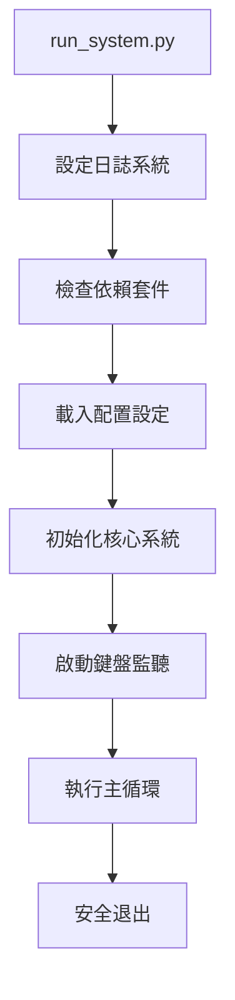

# 系統工作流程文件

> 🔄 Make10 自動化系統的執行階段、工作流程與操作指南

## 🎯 系統執行概覽

### 系統啟動流程


### 目前實作狀況
| 階段 | 狀態 | 實作位置 | 功能描述 |
|------|------|----------|----------|
| **系統啟動** | ✅ 完成 | `run_system.py` | 系統入口、日誌設定、依賴檢查 |
| **核心初始化** | ✅ 完成 | `src/core/main.py` | 系統核心模組初始化 |
| **鍵盤監聽** | ✅ 完成 | `src/automation/keyboard_listener.py` | 熱鍵監聽、安全退出 |
| **螢幕操作** | ✅ 完成 | `src/automation/screen_utils.py` | 螢幕擷取、滑鼠控制 |
| **AI 推理** | 🚧 規劃中 | `src/ai/` | 數字識別、模型推理 |
| **遊戲邏輯** | 🚧 規劃中 | `src/core/` | 解題算法、策略計算 |

## 📋 系統啟動流程

### 1. 系統入口 (`run_system.py`)
```python
def run_system():
    """系統啟動主函式"""
    print("=== Make10 遊戲自動化系統 v0.1.0 ===")
    
    # 1. 設定日誌系統
    setup_logging()
    logger.info("系統啟動中...")
    
    # 2. 檢查相依套件
    if not check_dependencies():
        logger.error("系統相依性檢查失敗")
        return False
    
    # 3. 啟動主程式
    try:
        main()
        return True
    except Exception as e:
        logger.error(f"系統啟動失敗: {e}")
        return False
```

### 2. 日誌系統設定
```python
def setup_logging():
    """配置雙重日誌輸出"""
    logger.remove()  # 移除預設處理器
    
    # 終端輸出 (彩色、即時)
    logger.add(
        sys.stderr,
        level="DEBUG",
        format="<green>{time:YY-MM-DD HH:mm:ss}</green> <level>[{level}]</level> <cyan>{message}</cyan>",
        colorize=True
    )
    
    # 檔案輸出 (輪轉、保留)
    logger.add(
        "logs/make10_system.log",
        rotation="1 day",
        retention="7 days", 
        level="INFO"
    )
```

### 3. 依賴檢查機制
```python
def check_dependencies():
    """檢查必要套件"""
    required_packages = {
        "cv2": "opencv-python",
        "numpy": "numpy", 
        "pynput": "pynput",
        "loguru": "loguru",
        "easydict": "easydict",
    }
    
    missing_packages = []
    for module_name, package_name in required_packages.items():
        try:
            __import__(module_name)
        except ImportError:
            missing_packages.append(package_name)
    
    if missing_packages:
        logger.error(f"缺少必要套件: {', '.join(missing_packages)}")
        return False
    
    return True
```

## 🧠 核心系統流程

### 系統初始化 (`src/core/main.py`)
```python
class GameAutomationSystem:
    """Make10 遊戲自動化系統核心"""
    
    def initialize(self):
        """初始化系統模組"""
        logger.info("初始化 Make10 遊戲自動化系統...")
        
        # 1. 初始化按鍵監聽器
        self.keyboard_listener = create_keyboard_listener(self.request_exit)
        self.keyboard_listener.start()
        
        # 2. TODO: 初始化 AI 模型
        # self.model_manager = ModelManager()
        
        # 3. TODO: 初始化電腦視覺模組  
        # self.vision_processor = VisionProcessor()
        
        # 4. TODO: 初始化自動化控制模組
        # self.automation_controller = AutomationController()
        
        self.initialized = True
        logger.info("系統核心模組初始化完成")
```

### 主要遊戲循環 (規劃中)
```python
def run_game_loop(self):
    """執行主要遊戲自動化流程"""
    if not self.initialized:
        raise RuntimeError("系統尚未初始化")
    
    logger.info("開始遊戲自動化流程")
    
    while not self.should_exit:
        try:
            # 1. 螢幕擷取與預處理
            screenshot = self.capture_game_screen()
            if screenshot is None:
                continue
            
            # 2. 遊戲狀態檢測
            game_state = self.detect_game_state(screenshot)
            if not game_state.is_ready:
                continue
                
            # 3. 數字識別與解析
            numbers = self.recognize_numbers(screenshot)
            if not numbers:
                continue
                
            # 4. 解答計算
            solution = self.calculate_solution(numbers)
            if not solution:
                logger.warning("無法找到解答")
                continue
                
            # 5. 執行自動化操作
            success = self.execute_solution(solution)
            if success:
                logger.info("解答執行成功")
            else:
                logger.warning("解答執行失敗")
                
        except Exception as e:
            logger.error(f"遊戲循環錯誤: {e}")
            
        time.sleep(0.1)  # 避免 CPU 過載
```

## 🎮 自動化控制流程

### 螢幕操作 (`src/automation/screen_utils.py`)
```python
# 已實作功能
def capture_screen() -> np.ndarray | None:
    """擷取當前螢幕畫面"""
    
def switch_screen() -> bool:
    """執行螢幕切換 (Alt+Tab)"""
    
def click_at_position(x: int, y: int) -> bool:
    """在指定座標點擊"""
    
def find_reset_button() -> tuple | None:
    """尋找重置按鈕位置"""
```

### 鍵盤監聽 (`src/automation/keyboard_listener.py`)
```python
def create_keyboard_listener(exit_callback):
    """建立鍵盤監聽器"""
    def on_key_combination():
        """熱鍵組合觸發"""
        logger.info("收到退出熱鍵，準備安全退出...")
        exit_callback()
    
    # 組合鍵: Ctrl+Q (可在 config/constants.py 設定)
    hotkey = keyboard.HotKey(
        keyboard.HotKey.parse('<ctrl>+q'),
        on_key_combination
    )
    
    listener = keyboard.Listener(
        on_press=hotkey.press,
        on_release=hotkey.release
    )
    
    return listener
```

## ⚙️ 配置管理流程

### 配置載入 (`config/settings.py`)
```python
# 路徑配置
cfg.PATHS = EasyDict({
    'MODEL': {
        'main_model': 'data/models/exports/model.keras',
        'checkpoints_dir': 'data/models/checkpoints'
    },
    'TRAINING': {
        'images_dir': 'data/training/images',
        'labels_dir': 'data/training/labels'
    }
})

# 自動化參數
cfg.AUTOMATION = EasyDict({
    'click_delay': 0.1,           # 點擊延遲 (秒)
    'screen_switch_delay': 0.5,   # 螢幕切換延遲
    'retry_attempts': 3,          # 重試次數
    'timeout': 30                 # 操作超時 (秒)
})

# 系統控制
cfg.SYSTEM = EasyDict({
    'exit_key': 'ctrl+q',         # 退出熱鍵
    'debug_mode': False           # 除錯模式
})
```

## 🔄 錯誤處理與恢復

### 異常處理策略
```python
def safe_execute_with_retry(operation, max_retries=3):
    """安全執行操作，包含重試機制"""
    for attempt in range(max_retries):
        try:
            return operation()
        except Exception as e:
            logger.warning(f"操作失敗 (嘗試 {attempt + 1}/{max_retries}): {e}")
            if attempt == max_retries - 1:
                logger.error(f"操作最終失敗: {e}")
                return None
            time.sleep(0.5)  # 重試前等待
    return None
```

### 系統監控與健康檢查
```python
def system_health_check():
    """系統健康狀態檢查"""
    checks = {
        'memory_usage': check_memory_usage(),
        'model_loaded': check_model_status(),
        'screen_access': check_screen_access(),
        'keyboard_listener': check_keyboard_listener()
    }
    
    failed_checks = [k for k, v in checks.items() if not v]
    if failed_checks:
        logger.warning(f"健康檢查失敗: {failed_checks}")
        return False
    
    return True
```

## 🚀 使用者操作指南

### 系統啟動
```bash
# 1. 進入專案目錄
cd make10-solver

# 2. 啟動系統
uv run run_system.py

# 3. 觀察日誌輸出
# [INFO] 系統啟動中...
# [INFO] 相依套件檢查通過
# [INFO] 系統核心模組初始化完成
```

### 熱鍵操作
- **Ctrl+Q** - 安全退出系統
- **Alt+Tab** - 螢幕切換 (自動執行)

### 日誌監控
```bash
# 即時查看日誌
tail -f logs/make10_system.log

# 搜尋錯誤訊息
grep "ERROR" logs/make10_system.log
```

## 📊 效能監控

### 系統指標
- **記憶體使用**: <200MB (待 AI 模組載入後評估)
- **CPU 使用率**: <10% (閒置時)
- **響應時間**: <100ms (螢幕操作)
- **日誌檔案**: 每日輪轉，保留 7 天

### 效能最佳化
```python
# 記憶體使用監控
def monitor_memory_usage():
    import psutil
    process = psutil.Process()
    memory_mb = process.memory_info().rss / 1024 / 1024
    logger.debug(f"記憶體使用: {memory_mb:.1f} MB")
    
    if memory_mb > 500:  # 超過 500MB 警告
        logger.warning(f"記憶體使用過高: {memory_mb:.1f} MB")
```

## 🔧 故障排除

### 常見問題
1. **系統無法啟動** - 檢查 Python 版本與套件安裝
2. **鍵盤監聽失效** - 確認應用程式有適當權限
3. **螢幕擷取失敗** - 檢查螢幕存取權限
4. **日誌檔案過大** - 自動輪轉機制，無需手動處理

### 除錯模式
```python
# 啟用除錯模式 (config/settings.py)
cfg.SYSTEM.debug_mode = True

# 除錯時的詳細日誌
if cfg.SYSTEM.debug_mode:
    logger.debug("詳細除錯資訊...")
```

## 📈 未來發展規劃

### 短期改進 (1-2 個月)
- [ ] 完整的 AI 模型整合
- [ ] 遊戲狀態檢測機制
- [ ] 自動化操作流程

### 中期目標 (3-6 個月)  
- [ ] 圖形使用者介面
- [ ] 配置檔案編輯器
- [ ] 即時效能監控面板

### 長期願景 (6+ 個月)
- [ ] 多遊戲支援架構
- [ ] 雲端服務整合
- [ ] 機器學習模型自動更新

#### 成功指標
- ✅ 所有設定檔正確載入
- ✅ AI 模型載入無錯誤
- ✅ 螢幕擷取功能可用
- ✅ 滑鼠控制功能正常

---

### 2. 遊戲偵測階段 (Game Detection Phase)
**目標**: 定位遊戲視窗並確認遊戲狀態

#### 主要任務
- 🖥️ 螢幕擷取與監控
- 🔍 遊戲視窗定位
- 🎮 遊戲狀態檢測（是否在遊戲中）
- 🔄 重置按鈕偵測

#### 執行流程
```python
def detect_game():
    # 1. 全螢幕擷取
    screenshot = screen_capture.capture_full_screen()
    
    # 2. 重置按鈕模板匹配
    reset_button_pos = find_reset_button(screenshot)
    
    # 3. 計算遊戲區域座標
    if reset_button_pos:
        game_area = calculate_game_area(reset_button_pos)
        return GameDetectionResult(True, game_area)
    
    # 4. 多螢幕檢測
    for screen in get_available_screens():
        if detect_game_on_screen(screen):
            return GameDetectionResult(True, screen)
    
    return GameDetectionResult(False, None)
```

#### 技術細節
- **模板匹配**: 使用 OpenCV 偵測重置按鈕
- **多螢幕支援**: 自動切換到包含遊戲的螢幕
- **容錯機制**: 支援不同解析度與縮放比例

---

### 3. 盤面掃描階段 (Board Scanning Phase)
**目標**: 擷取並處理遊戲盤面圖像

#### 主要任務
- 📷 擷取遊戲盤面截圖
- ✂️ 圖像預處理與分割
- 🔢 數字識別與預測
- 🏗️ 盤面資料結構建立
- ✅ 掃描結果驗證

#### 執行流程
```python
def scan_board():
    # 1. 擷取盤面區域
    board_image = capture_board_area(game_area)
    
    # 2. 霍夫直線檢測網格
    grid_lines = detect_grid_lines(board_image)
    
    # 3. 計算 cell 座標
    cell_coordinates = calculate_cell_positions(grid_lines)
    
    # 4. 提取所有 cell 圖像
    cell_images = extract_cell_images(board_image, cell_coordinates)
    
    # 5. 批次預測數字
    predictions = ai_model.predict_batch(cell_images)
    
    # 6. 建立盤面矩陣
    board_matrix = construct_board_matrix(predictions)
    
    return BoardScanResult(board_matrix, confidence_scores)
```

#### 核心技術
- **霍夫直線檢測**: 自動偵測網格線
- **投影直方圖**: 驗證網格位置準確性
- **動態座標**: 適應不同遊戲視窗大小
- **批次處理**: 一次處理 250 個 cell

---

### 4. 解答計算階段 (Solution Computing Phase)
**目標**: 分析盤面並計算最佳解答策略

#### 主要任務
- 🧠 使用求解演算法分析盤面
- 🔍 尋找所有可能的解答路徑
- 📊 解答評分與排序
- 🎯 選擇最佳解答策略
- 📈 優化解答組合

#### 執行流程
```python
def compute_solution(board_matrix):
    # 1. 盤面有效性檢查
    if not validate_board(board_matrix):
        return SolutionResult(False, "無效盤面")
    
    # 2. 基礎遞迴求解
    basic_solutions = basic_recursive_solver(board_matrix)
    
    # 3. 分支限界優化
    if len(basic_solutions) > 10:
        optimized_solutions = branch_bound_solver(board_matrix)
    else:
        optimized_solutions = basic_solutions
    
    # 4. 解答評分
    scored_solutions = score_solutions(optimized_solutions)
    
    # 5. 選擇最佳解答
    best_solution = select_best_solution(scored_solutions)
    
    return SolutionResult(True, best_solution)
```

#### 演算法策略
- **遞迴搜尋**: 深度優先搜尋所有可能組合
- **分支限界**: 優化搜尋空間，減少計算時間
- **評分機制**: 考慮移動步數、複雜度等因素
- **多解答**: 提供備選方案

---

### 5. 動作執行階段 (Action Execution Phase)
**目標**: 將解答轉換為具體的滑鼠操作

#### 主要任務
- 🖱️ 滑鼠移動與點擊
- 📍 座標計算與轉換
- ⏱️ 動作時間控制
- 🔄 動作序列執行
- 📊 執行結果監控

#### 執行流程
```python
def execute_solution(solution):
    execution_log = []
    
    for move in solution.moves:
        # 1. 計算起始和結束座標
        start_pos = convert_to_screen_coordinates(move.start)
        end_pos = convert_to_screen_coordinates(move.end)
        
        # 2. 執行拖拽動作
        mouse_controller.drag(start_pos, end_pos)
        
        # 3. 等待動畫完成
        time.sleep(settings.move_delay)
        
        # 4. 驗證移動結果
        if verify_move_success():
            execution_log.append(f"✅ 移動成功: {move}")
        else:
            execution_log.append(f"❌ 移動失敗: {move}")
            return ExecutionResult(False, execution_log)
    
    return ExecutionResult(True, execution_log)
```

#### 控制技術
- **平滑移動**: 模擬人類滑鼠移動軌跡
- **精確座標**: 亞像素級座標計算
- **時間控制**: 可調整的動作延遲
- **錯誤恢復**: 移動失敗時的重試機制

---

### 6. 結果驗證階段 (Result Validation Phase)
**目標**: 驗證執行結果並更新系統狀態

#### 主要任務
- 🔍 檢查遊戲狀態變化
- ✅ 驗證解答是否成功
- 📈 更新遊戲統計資料
- 🔄 準備下一輪遊戲
- 📝 記錄執行日誌

#### 執行流程
```python
def validate_results():
    # 1. 等待遊戲狀態更新
    time.sleep(settings.validation_delay)
    
    # 2. 重新掃描盤面
    current_board = scan_board()
    
    # 3. 檢查是否達成目標
    if check_win_condition(current_board):
        # 遊戲完成
        stats.record_success()
        log_success("遊戲成功完成")
        return ValidationResult(True, "WIN")
    
    elif check_no_moves_available(current_board):
        # 無可用移動
        stats.record_failure("無可用移動")
        return ValidationResult(False, "NO_MOVES")
    
    else:
        # 繼續遊戲
        return ValidationResult(True, "CONTINUE")
```

#### 驗證機制
- **視覺驗證**: 重新掃描盤面確認變化
- **邏輯驗證**: 檢查移動是否符合遊戲規則
- **狀態追蹤**: 記錄遊戲進度與統計
- **日誌記錄**: 詳細記錄執行過程

---

### 7. 錯誤處理階段 (Error Handling Phase)
**目標**: 處理執行過程中的異常情況

#### 主要任務
- ⚠️ 異常情況偵測
- 🔧 錯誤恢復機制
- 📝 錯誤日誌記錄
- 🔄 重試策略執行
- 🛑 安全停止機制

#### 錯誤類型與處理

##### 系統級錯誤
```python
def handle_system_error(error):
    if isinstance(error, ModelLoadError):
        # AI 模型載入失敗
        logger.error("AI 模型載入失敗，嘗試重新載入")
        return reload_model()
    
    elif isinstance(error, ScreenCaptureError):
        # 螢幕擷取失敗
        logger.error("螢幕擷取失敗，檢查權限設定")
        return reinitialize_screen_capture()
```

##### 遊戲級錯誤
```python
def handle_game_error(error):
    if isinstance(error, GameNotFoundError):
        # 找不到遊戲視窗
        return wait_for_game_window()
    
    elif isinstance(error, BoardScanError):
        # 盤面掃描失敗
        return retry_board_scan(max_attempts=3)
```

##### 執行級錯誤
```python
def handle_execution_error(error):
    if isinstance(error, MoveExecutionError):
        # 移動執行失敗
        return retry_move_with_adjustment()
    
    elif isinstance(error, SolutionNotFoundError):
        # 找不到解答
        return request_manual_intervention()
```

## 🔄 完整執行循環

```python
def main_execution_loop():
    while True:
        try:
            # 階段 1: 初始化
            system = initialize_system()
            
            # 階段 2: 遊戲偵測
            game_info = detect_game()
            if not game_info.found:
                wait_for_game()
                continue
            
            # 階段 3: 盤面掃描
            board_result = scan_board()
            if not board_result.valid:
                handle_scan_error()
                continue
            
            # 階段 4: 解答計算
            solution = compute_solution(board_result.board)
            if not solution.found:
                handle_no_solution()
                continue
            
            # 階段 5: 動作執行
            execution_result = execute_solution(solution)
            if not execution_result.success:
                handle_execution_error()
                continue
            
            # 階段 6: 結果驗證
            validation = validate_results()
            
            if validation.status == "WIN":
                celebrate_success()
                wait_for_new_game()
            elif validation.status == "NO_MOVES":
                handle_game_over()
            # 繼續下一次循環
            
        except SystemExit:
            logger.info("系統正常退出")
            break
        except Exception as e:
            # 階段 7: 錯誤處理
            handle_unexpected_error(e)
            if should_continue_after_error():
                continue
            else:
                break
```

## 📊 效能監控指標

### 執行時間基準
- **初始化階段**: < 2 秒
- **遊戲偵測**: < 1 秒
- **盤面掃描**: < 2 秒
- **解答計算**: < 5 秒
- **動作執行**: 視解答複雜度 (10-60 秒)
- **結果驗證**: < 1 秒

### 成功率目標
- **遊戲偵測成功率**: > 95%
- **盤面掃描準確率**: > 90%
- **解答計算成功率**: > 85%
- **動作執行成功率**: > 90%
- **整體系統成功率**: > 75%

### 資源使用監控
```python
def monitor_system_performance():
    memory_usage = psutil.virtual_memory().percent
    cpu_usage = psutil.cpu_percent()
    gpu_usage = get_gpu_usage()  # 如果有 GPU
    
    logger.info(f"系統資源使用 - CPU: {cpu_usage}%, 記憶體: {memory_usage}%, GPU: {gpu_usage}%")
```

## 🛠️ 調整與最佳化

### 效能調整參數
```python
# config/performance_settings.py
SCAN_TIMEOUT = 5.0           # 掃描逾時時間
MOVE_DELAY = 0.5             # 移動間隔延遲
VALIDATION_DELAY = 1.0       # 驗證等待時間
MAX_RETRY_ATTEMPTS = 3       # 最大重試次數
CONFIDENCE_THRESHOLD = 0.8   # AI 預測信心度門檻
```

### 除錯模式設定
```python
# 啟用詳細日誌
DEBUG_MODE = True
SAVE_DEBUG_IMAGES = True
LOG_LEVEL = "DEBUG"

# 啟用效能分析
ENABLE_PROFILING = True
MEMORY_MONITORING = True
```

透過理解這個工作流程，您可以更好地使用、除錯和改進 Make10 自動化系統。
