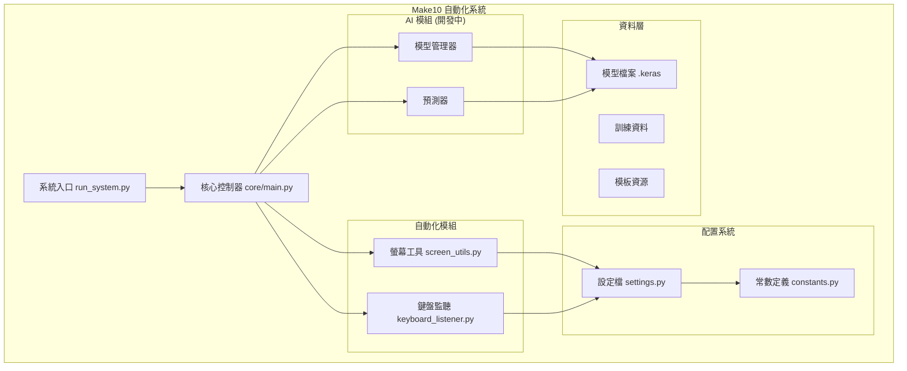

# 技術架構文件

> 🏗️ Make10 自動化系統的技術架構、核心演算法與實作細節

## 🎯 系統設計原則

### 架構理念
- **模組化設計** - 功能獨立、介面清晰的元件架構
- **可擴展性** - 支援新功能模組的熱插拔
- **高效能** - 最佳化記憶體使用與 CPU 效能
- **容錯機制** - 完善的錯誤處理與恢復策略
- **可維護性** - 清晰的程式碼結構與文件

### 架構模式
```
┌─────────────────┐    ┌─────────────────┐    ┌─────────────────┐
│   控制層        │    │    業務邏輯層    │    │    資料層       │
│  (Control)      │────│   (Business)    │────│    (Data)       │
│                 │    │                 │    │                 │
└─────────────────┘    └─────────────────┘    └─────────────────┘
 鍵盤監聽/螢幕控制      遊戲邏輯/AI 推理       配置管理/模型存儲
```

## 🏗️ 系統架構圖



## 💻 實作狀況

### ✅ 已實作功能
| 模組 | 檔案路徑 | 功能狀態 | 說明 |
|------|----------|----------|------|
| **核心系統** | `src/core/main.py` | ✅ 完成 | 系統啟動、初始化、主循環 |
| **螢幕工具** | `src/automation/screen_utils.py` | ✅ 完成 | 螢幕擷取、滑鼠控制、模板匹配 |
| **鍵盤監聽** | `src/automation/keyboard_listener.py` | ✅ 完成 | 熱鍵監聽、安全退出機制 |
| **配置系統** | `config/settings.py` | ✅ 完成 | 參數管理、路徑配置 |
| **測試套件** | `tests/` | ✅ 完成 | 單元測試、模擬測試 |

### 🚧 開發中功能
| 模組 | 檔案路徑 | 開發狀態 | 計畫 |
|------|----------|----------|------|
| **AI 模型** | `src/ai/` | 🚧 規劃中 | CNN 數字識別模型 |
| **標籤工具** | `src/labeling/` | 🚧 規劃中 | 訓練資料標註工具 |
| **訓練流程** | `run_training.py` | 🚧 開發中 | 模型訓練自動化 |

## 🔧 技術棧詳解

### 核心依賴套件
```toml
# 電腦視覺與影像處理
opencv-python = "4.12.0.88"     # 影像處理核心
numpy = "2.1.3"                 # 數值計算基礎
pillow = "11.3.0"               # 影像格式支援

# 機器學習框架
tensorflow = "2.19.0"           # 深度學習框架

# 自動化控制
pynput = "1.8.1"               # 鍵盤滑鼠控制
mss = "10.0.0"                 # 高效能螢幕擷取

# 資料處理與工具
pandas = "2.3.1"               # 資料分析
loguru = "0.7.3"               # 日誌系統
easydict = "1.13"              # 配置管理
```

### 架構元件說明

#### 1. 自動化控制層
```python
# 螢幕工具範例
from src.automation.screen_utils import (
    capture_screen,      # 螢幕擷取
    click_at_position,   # 精確點擊
    find_reset_button,   # 模板匹配
    switch_screen        # 視窗切換
)

# 使用範例
screenshot = capture_screen()           # 擷取螢幕
success = click_at_position(100, 200)   # 點擊座標
switch_screen()                         # Alt+Tab 切換
```

#### 2. 配置管理系統
```python
from config.settings import cfg

# 路徑配置
model_path = cfg.PATHS.MODEL.main_model
training_dir = cfg.PATHS.TRAINING.images_dir

# 系統參數
click_delay = cfg.AUTOMATION.click_delay
exit_key = cfg.SYSTEM.exit_key

# 影像處理參數
cell_size = cfg.IMAGE.PROCESSING.cell_size
confidence = cfg.MODEL.confidence_threshold
```

#### 3. 日誌系統
```python
from loguru import logger

# 多層級日誌輸出
logger.debug("除錯資訊")     # 開發階段
logger.info("一般資訊")      # 正常運行
logger.warning("警告訊息")   # 注意事項  
logger.error("錯誤資訊")     # 錯誤處理

# 自動檔案輪轉
# logs/make10_system.log (保留 7 天)
```

## 🧠 ResNet50 AI 模型架構

### ResNet50 模型設計
```python
# 基於 ResNet50 的數字識別架構
def create_resnet50_digit_model(pretrained=True):
    """建立 ResNet50 數字識別模型"""
    
    # 載入 ResNet50 預訓練模型
    base_model = tf.keras.applications.ResNet50(
        weights='imagenet' if pretrained else None,
        include_top=False,
        input_shape=(224, 224, 3)
    )
    
    # 建立完整模型
    model = tf.keras.Sequential([
        # 輸入層
        tf.keras.layers.Input(shape=(224, 224, 3)),
        
        # ResNet50 特徵提取器
        base_model,
        
        # 全域平均池化
        tf.keras.layers.GlobalAveragePooling2D(),
        
        # 分類頭
        tf.keras.layers.Dense(512, activation='relu'),
        tf.keras.layers.Dropout(0.5),
        tf.keras.layers.BatchNormalization(),
        tf.keras.layers.Dense(10, activation='softmax')  # 10 類別數字
    ])
    
    return model

def create_resnet50_ensemble():
    """建立 ResNet50 集成模型"""
    
    # 建立多個略有不同的 ResNet50 模型
    models = []
    
    for i in range(3):  # 3 個模型集成
        model = create_resnet50_digit_model(pretrained=True)
        
        # 添加些許隨機性
        if i > 0:
            # 不同的 dropout 率
            model.layers[-3] = tf.keras.layers.Dropout(0.5 + i * 0.1)
        
        models.append(model)
    
    return models
```

### 遷移學習策略
```python
def implement_transfer_learning_strategy():
    """實作遷移學習策略"""
    
    strategies = {
        'feature_extraction': {
            'description': '凍結預訓練層，只訓練分類頭',
            'base_trainable': False,
            'learning_rate': 0.001,
            'epochs': 10,
            'use_case': '資料量較少時使用'
        },
        
        'fine_tuning': {
            'description': '解凍部分層進行微調',
            'base_trainable': True,
            'freeze_layers': -20,  # 凍結前 N 層
            'learning_rate': 0.0001,
            'epochs': 20,
            'use_case': '有足夠資料時使用'
        },
        
        'full_training': {
            'description': '從頭訓練整個網路',
            'base_trainable': True,
            'freeze_layers': 0,
            'learning_rate': 0.0001,
            'epochs': 50,
            'use_case': '大量資料且計算資源充足'
        }
    }
    
    return strategies
```

### 資料流程設計 (ResNet50)
```python
# ResNet50 專用推理流程
def predict_digit_resnet50(image_region):
    """ResNet50 數字識別推理"""
    
    # 1. 影像預處理 (224x224 RGB)
    processed = preprocess_for_resnet50(image_region)
    
    # 2. 模型推理
    prediction = resnet50_model.predict(processed, verbose=0)
    
    # 3. 結果後處理
    digit = np.argmax(prediction[0])
    confidence = np.max(prediction[0])
    all_probs = prediction[0]
    
    # 4. 信心度檢查
    if confidence < cfg.MODEL.confidence_threshold:
        return None, confidence  # 低信心度樣本
    
    return digit, confidence

def preprocess_for_resnet50(image_region):
    """ResNet50 專用預處理"""
    
    # 調整大小到 224x224
    resized = cv2.resize(image_region, (224, 224))
    
    # 確保 RGB 格式
    if len(resized.shape) == 2:
        rgb_image = cv2.cvtColor(resized, cv2.COLOR_GRAY2RGB)
    elif resized.shape[2] == 1:
        rgb_image = np.repeat(resized, 3, axis=2)
    else:
        rgb_image = cv2.cvtColor(resized, cv2.COLOR_BGR2RGB)
    
    # ImageNet 標準化
    normalized = tf.keras.applications.resnet50.preprocess_input(
        rgb_image.astype(np.float32)
    )
    
    # 添加批次維度
    return np.expand_dims(normalized, axis=0)

def ensemble_prediction(image_region, models):
    """集成模型預測"""
    
    predictions = []
    
    # 收集所有模型的預測
    for model in models:
        pred = model.predict(preprocess_for_resnet50(image_region), verbose=0)
        predictions.append(pred[0])
    
    # 平均集成
    avg_prediction = np.mean(predictions, axis=0)
    
    # 投票集成
    votes = [np.argmax(pred) for pred in predictions]
    vote_counts = np.bincount(votes, minlength=10)
    voted_digit = np.argmax(vote_counts)
    
    return {
        'average_prediction': {
            'digit': int(np.argmax(avg_prediction)),
            'confidence': float(np.max(avg_prediction)),
            'probabilities': avg_prediction.tolist()
        },
        'voting_prediction': {
            'digit': int(voted_digit),
            'votes': vote_counts.tolist(),
            'consensus': float(np.max(vote_counts) / len(models))
        }
    }
```

### 模型最佳化技術
```python
def optimize_resnet50_inference():
    """ResNet50 推理最佳化"""
    
    optimization_techniques = {
        'model_quantization': {
            'description': '模型量化減少記憶體使用',
            'implementation': '''
            converter = tf.lite.TFLiteConverter.from_keras_model(model)
            converter.optimizations = [tf.lite.Optimize.DEFAULT]
            tflite_model = converter.convert()
            '''
        },
        
        'batch_inference': {
            'description': '批次推理提升吞吐量',
            'implementation': '''
            # 累積多個影像再一次推理
            if len(batch_images) >= batch_size:
                predictions = model.predict(np.array(batch_images))
                batch_images.clear()
            '''
        },
        
        'model_pruning': {
            'description': '模型剪枝移除不重要的連接',
            'implementation': '''
            import tensorflow_model_optimization as tfmot
            prune_low_magnitude = tfmot.sparsity.keras.prune_low_magnitude
            pruned_model = prune_low_magnitude(model)
            '''
        },
        
        'mixed_precision': {
            'description': '混合精度加速訓練',
            'implementation': '''
            policy = tf.keras.mixed_precision.Policy('mixed_float16')
            tf.keras.mixed_precision.set_global_policy(policy)
            '''
        }
    }
    
    return optimization_techniques
```

## 📊 效能最佳化策略

### 記憶體管理
- **影像處理**: 使用 NumPy 原地操作減少記憶體分配
- **模型推理**: 批次處理提升 GPU 利用率
- **資源釋放**: 自動垃圾回收與資源清理

### CPU 最佳化
- **多執行緒**: 分離 UI 操作與計算任務
- **演算法**: 選擇時間複雜度較低的演算法
- **快取機制**: 常用資料與計算結果快取

### 系統穩定性
- **錯誤恢復**: 完善的例外處理機制
- **超時控制**: 避免無限等待的超時機制
- **資源監控**: 記憶體與 CPU 使用量監控

## 🔬 測試策略

### 單元測試
```python
# 測試覆蓋範圍
pytest tests/ --cov=src --cov-report=html

# 主要測試模組
tests/test_screen_utils.py      # 螢幕工具測試
tests/test_keyboard_listener.py # 鍵盤監聽測試
tests/test_config_settings.py   # 配置系統測試
```

### 整合測試
- **端到端流程**: 完整的自動化流程測試
- **模擬環境**: 使用 Mock 物件模擬外部依賴
- **性能測試**: 響應時間與資源使用測試
    # 1. 圖像預處理
    gray = cv2.cvtColor(image, cv2.COLOR_BGR2GRAY)
    
    # 2. 高斯模糊去雜訊
    blurred = cv2.GaussianBlur(gray, (5, 5), 0)
    
    # 3. 自適應邊緣檢測
    edges = cv2.Canny(blurred, 50, 150, apertureSize=3)
    
    # 4. 霍夫直線檢測
    lines = cv2.HoughLinesP(
        edges,
        rho=1,              # 距離解析度 (像素)
        theta=np.pi/180,    # 角度解析度 (弧度)
        threshold=100,      # 最小投票數
        minLineLength=50,   # 最小線段長度
        maxLineGap=10       # 最大線段間隙
    )
    
    # 5. 線段分類與過濾
    horizontal_lines = []
    vertical_lines = []
    
    if lines is not None:
        for line in lines:
            x1, y1, x2, y2 = line[0]
            
            # 計算線段角度
            angle = np.arctan2(y2 - y1, x2 - x1) * 180 / np.pi
            
            # 分類水平和垂直線段
            if abs(angle) < 10 or abs(angle) > 170:
                horizontal_lines.append(line)
            elif abs(abs(angle) - 90) < 10:
                vertical_lines.append(line)
    
    # 6. 線段合併與最佳化
    merged_h_lines = merge_collinear_lines(horizontal_lines)
    merged_v_lines = merge_collinear_lines(vertical_lines)
    
    return merged_h_lines, merged_v_lines

def merge_collinear_lines(lines, distance_threshold=10, angle_threshold=5):
    """合併共線的線段"""
    if not lines:
        return []
    
    merged_lines = []
    used = [False] * len(lines)
    
    for i, line1 in enumerate(lines):
        if used[i]:
            continue
            
        group = [line1]
        used[i] = True
        
        for j, line2 in enumerate(lines[i+1:], i+1):
            if used[j]:
                continue
                
            if are_lines_collinear(line1[0], line2[0], distance_threshold, angle_threshold):
                group.append(line2)
                used[j] = True
        
        # 合併同組線段
        merged_line = merge_line_group(group)
        merged_lines.append(merged_line)
    
    return merged_lines
```

### 2. 投影直方圖驗證

#### 原理說明
投影直方圖是一種輔助驗證網格檢測結果的技術，通過分析圖像在水平和垂直方向的像素累積分佈來確認網格線位置。

#### 實作細節
```python
def projection_histogram_validation(edges, detected_lines):
    """使用投影直方圖驗證網格檢測結果"""
    
    height, width = edges.shape
    
    # 1. 計算投影直方圖
    horizontal_projection = np.sum(edges, axis=1)  # 水平投影
    vertical_projection = np.sum(edges, axis=0)    # 垂直投影
    
    # 2. 尋找投影峰值
    h_peaks = find_projection_peaks(horizontal_projection)
    v_peaks = find_projection_peaks(vertical_projection)
    
    # 3. 與檢測到的線段比較
    validated_h_lines = validate_lines_with_projection(
        detected_lines['horizontal'], h_peaks, 'horizontal'
    )
    validated_v_lines = validate_lines_with_projection(
        detected_lines['vertical'], v_peaks, 'vertical'
    )
    
    return {
        'horizontal': validated_h_lines,
        'vertical': validated_v_lines,
        'confidence': calculate_validation_confidence(h_peaks, v_peaks)
    }

def find_projection_peaks(projection, prominence=0.3):
    """尋找投影直方圖中的峰值"""
    from scipy.signal import find_peaks
    
    # 正規化投影
    normalized = projection / np.max(projection)
    
    # 尋找峰值
    peaks, properties = find_peaks(
        normalized, 
        prominence=prominence,
        distance=20  # 最小峰值間距
    )
    
    return peaks
```

### 3. AI 預測最佳化

#### 批次處理架構
```python
class OptimizedPredictor:
    """最佳化的 AI 預測器"""
    
    def __init__(self, model, batch_size=32):
        self.model = model
        self.batch_size = batch_size
        self.prediction_cache = {}
        
    def predict_board_optimized(self, cell_images):
        """最佳化的盤面預測"""
        
        # 1. 圖像預處理管道
        processed_images = self.preprocess_batch(cell_images)
        
        # 2. 批次預測
        predictions = self.batch_predict(processed_images)
        
        # 3. 後處理與信心度評估
        results = self.postprocess_predictions(predictions)
        
        # 4. 品質檢查與修正
        validated_results = self.validate_predictions(results, cell_images)
        
        return validated_results
    
    def preprocess_batch(self, images):
        """批次圖像預處理"""
        batch = np.zeros((len(images), 28, 28, 1), dtype=np.float32)
        
        for i, img in enumerate(images):
            # 尺寸正規化
            resized = cv2.resize(img, (28, 28))
            
            # 灰階轉換
            if len(resized.shape) == 3:
                gray = cv2.cvtColor(resized, cv2.COLOR_BGR2GRAY)
            else:
                gray = resized
            
            # 數值正規化
            normalized = gray.astype(np.float32) / 255.0
            
            # 加入批次維度
            batch[i] = normalized.reshape(28, 28, 1)
        
        return batch
    
    def batch_predict(self, batch):
        """執行批次預測"""
        return self.model.predict(batch, batch_size=self.batch_size)
    
    def postprocess_predictions(self, predictions):
        """後處理預測結果"""
        results = []
        
        for pred in predictions:
            # 取得最高機率的類別
            predicted_class = np.argmax(pred)
            confidence = np.max(pred)
            
            # 計算熵作為不確定性指標
            entropy = -np.sum(pred * np.log(pred + 1e-8))
            
            results.append({
                'class': predicted_class,
                'confidence': confidence,
                'entropy': entropy,
                'probabilities': pred
            })
        
        return results
```

### 4. 求解演算法架構

#### 多層次求解策略
```python
class HierarchicalSolver:
    """階層式求解器"""
    
    def __init__(self):
        self.solvers = [
            BasicRecursiveSolver(),
            BranchBoundSolver(),
            GeneticAlgorithmSolver()
        ]
    
    def solve(self, board, time_limit=10.0):
        """使用多種演算法求解"""
        
        solutions = []
        start_time = time.time()
        
        for solver in self.solvers:
            if time.time() - start_time > time_limit:
                break
                
            try:
                # 為每個求解器分配時間片
                remaining_time = time_limit - (time.time() - start_time)
                solver_time_limit = remaining_time / len(self.solvers)
                
                solver_solutions = solver.solve(board, solver_time_limit)
                solutions.extend(solver_solutions)
                
                # 如果找到足夠的解答，提早退出
                if len(solutions) >= 5:
                    break
                    
            except Exception as e:
                logger.warning(f"Solver {solver.__class__.__name__} failed: {e}")
                continue
        
        # 評估和排序解答
        scored_solutions = self.score_solutions(solutions)
        return scored_solutions

class BranchBoundSolver:
    """分支限界求解器"""
    
    def solve(self, board, time_limit=5.0):
        """使用分支限界法求解"""
        
        start_time = time.time()
        best_solutions = []
        
        # 初始化搜尋樹
        initial_state = GameState(board)
        priority_queue = [(0, initial_state)]
        
        while priority_queue and time.time() - start_time < time_limit:
            # 取得最優節點
            priority, current_state = heapq.heappop(priority_queue)
            
            # 檢查是否為解答
            if current_state.is_solved():
                best_solutions.append(current_state.get_solution())
                if len(best_solutions) >= 3:  # 限制解答數量
                    break
                continue
            
            # 生成子節點
            for next_state in current_state.generate_next_states():
                # 計算下界 (啟發式函式)
                lower_bound = self.calculate_lower_bound(next_state)
                
                # 剪枝條件
                if lower_bound < float('inf'):
                    heapq.heappush(priority_queue, (lower_bound, next_state))
        
        return best_solutions
    
    def calculate_lower_bound(self, state):
        """計算狀態的下界估計"""
        # 啟發式函式：剩餘移動次數的最佳估計
        remaining_numbers = state.count_remaining_numbers()
        min_moves_needed = max(0, remaining_numbers - 1)
        return state.moves_count + min_moves_needed
```

## 🔧 系統最佳化策略

### 記憶體管理
```python
class MemoryManager:
    """記憶體管理器"""
    
    def __init__(self):
        self.image_pool = ImagePool(size=50)
        self.prediction_cache = LRUCache(maxsize=1000)
        
    @contextmanager
    def managed_prediction(self):
        """管理預測過程中的記憶體使用"""
        try:
            # 預測前清理
            gc.collect()
            tf.keras.backend.clear_session()
            
            yield
            
        finally:
            # 預測後清理
            gc.collect()

class ImagePool:
    """圖像物件池"""
    
    def __init__(self, size=50):
        self.pool = [np.zeros((28, 28), dtype=np.uint8) for _ in range(size)]
        self.available = list(self.pool)
        self.lock = threading.Lock()
    
    def get_image(self):
        """取得可用的圖像物件"""
        with self.lock:
            if self.available:
                return self.available.pop()
            else:
                # 池已滿，建立新物件
                return np.zeros((28, 28), dtype=np.uint8)
    
    def return_image(self, img):
        """歸還圖像物件到池中"""
        with self.lock:
            img.fill(0)  # 清除資料
            if len(self.available) < len(self.pool):
                self.available.append(img)
```

### 多執行緒架構
```python
class ConcurrentGameEngine:
    """並行遊戲引擎"""
    
    def __init__(self):
        self.screen_capture_thread = None
        self.prediction_thread = None
        self.solver_thread = None
        
        # 執行緒間通訊
        self.image_queue = queue.Queue(maxsize=10)
        self.prediction_queue = queue.Queue(maxsize=5)
        self.solution_queue = queue.Queue(maxsize=3)
    
    def start_concurrent_processing(self):
        """啟動並行處理"""
        
        # 螢幕擷取執行緒
        self.screen_capture_thread = threading.Thread(
            target=self.continuous_screen_capture,
            daemon=True
        )
        
        # AI 預測執行緒
        self.prediction_thread = threading.Thread(
            target=self.continuous_prediction,
            daemon=True
        )
        
        # 求解執行緒
        self.solver_thread = threading.Thread(
            target=self.continuous_solving,
            daemon=True
        )
        
        # 啟動所有執行緒
        self.screen_capture_thread.start()
        self.prediction_thread.start()
        self.solver_thread.start()
    
    def continuous_screen_capture(self):
        """持續螢幕擷取"""
        while not self.shutdown_event.is_set():
            try:
                screenshot = self.capture_screen()
                if not self.image_queue.full():
                    self.image_queue.put(screenshot, timeout=0.1)
            except Exception as e:
                logger.error(f"Screen capture error: {e}")
            
            time.sleep(0.1)  # 控制擷取頻率
```

### 快取策略
```python
class PredictionCache:
    """預測結果快取"""
    
    def __init__(self, maxsize=1000):
        self.cache = {}
        self.access_times = {}
        self.maxsize = maxsize
    
    def get_cache_key(self, image):
        """產生圖像的快取鍵"""
        # 使用圖像雜湊作為鍵
        return hashlib.md5(image.tobytes()).hexdigest()
    
    def get(self, image):
        """取得快取的預測結果"""
        key = self.get_cache_key(image)
        
        if key in self.cache:
            self.access_times[key] = time.time()
            return self.cache[key]
        
        return None
    
    def put(self, image, prediction):
        """儲存預測結果到快取"""
        key = self.get_cache_key(image)
        
        # 檢查快取大小
        if len(self.cache) >= self.maxsize:
            self.evict_lru()
        
        self.cache[key] = prediction
        self.access_times[key] = time.time()
    
    def evict_lru(self):
        """清除最久未使用的項目"""
        lru_key = min(self.access_times, key=self.access_times.get)
        del self.cache[lru_key]
        del self.access_times[lru_key]
```

## 📊 效能監控架構

### 系統監控
```python
class SystemMonitor:
    """系統效能監控器"""
    
    def __init__(self):
        self.metrics = {
            'screen_capture_time': [],
            'prediction_time': [],
            'solving_time': [],
            'memory_usage': [],
            'cpu_usage': []
        }
        
        self.monitoring = False
        self.monitor_thread = None
    
    def start_monitoring(self):
        """開始監控"""
        self.monitoring = True
        self.monitor_thread = threading.Thread(
            target=self._monitor_loop,
            daemon=True
        )
        self.monitor_thread.start()
    
    def _monitor_loop(self):
        """監控循環"""
        while self.monitoring:
            # 收集系統指標
            memory_usage = psutil.virtual_memory().percent
            cpu_usage = psutil.cpu_percent()
            
            self.metrics['memory_usage'].append(memory_usage)
            self.metrics['cpu_usage'].append(cpu_usage)
            
            # 檢查異常情況
            if memory_usage > 90:
                logger.warning(f"High memory usage: {memory_usage}%")
            
            if cpu_usage > 90:
                logger.warning(f"High CPU usage: {cpu_usage}%")
            
            time.sleep(5)  # 每 5 秒監控一次
    
    @contextmanager
    def measure_time(self, metric_name):
        """測量操作時間"""
        start_time = time.time()
        try:
            yield
        finally:
            duration = time.time() - start_time
            self.metrics[metric_name].append(duration)
    
    def get_performance_summary(self):
        """取得效能摘要"""
        summary = {}
        
        for metric_name, values in self.metrics.items():
            if values:
                summary[metric_name] = {
                    'avg': np.mean(values),
                    'min': np.min(values),
                    'max': np.max(values),
                    'std': np.std(values),
                    'count': len(values)
                }
        
        return summary
```

透過這個技術架構，Make10 專案實現了高效能、可擴展和穩定的自動化遊戲求解系統。
